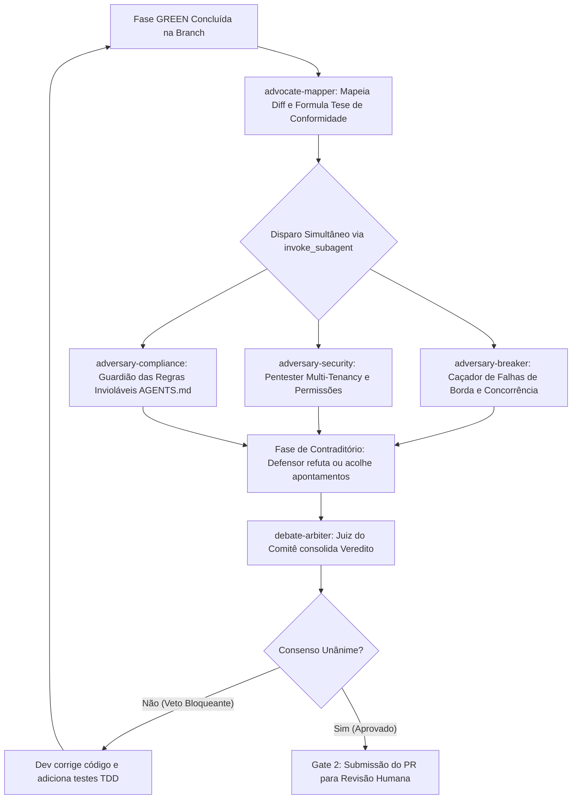

# Workflow Normativo: Debate Adversarial Multi-Agente Pre-PR

Este documento define o protocolo formal de **Debate Dialético Multi-Agente (Adversarial Red Team vs. White Team)** executado antes de submeter qualquer Pull Request para a aprovação humana no **Gate 2**.

---

## 1. Fundamentos e Objetivo

O objetivo do debate adversarial é eliminar o viés de confirmação e a complacência de revisões automáticas externas sujeitas a limite de taxa (*rate limit*). 

Subagentes autônomos com personas antagônicas analisam simultaneamente o diff da branch (`git diff origin/main...HEAD`) e se enfrentam em um processo dialético:
1. **Tese:** O defensor mapeia as implementações e defende a conformidade com a Spec SDD.
2. **Antítese:** Três atacantes especializados tentam ativamente quebrar a lógica, invadir a segurança e encontrar infrações normativas.
3. **Contraditório:** As alegações de falha são confrontadas com o código e testes existentes.
4. **Síntese (Veredito):** O árbitro consolida o relatório unânime ou emite veto bloqueante para correção imediata.

---

## 2. Diagrama do Fluxo de Debate



---

## 3. Personas dos Subagentes do Comitê

### 3.1 `advocate-mapper` (O Defensor / Mapeador)
- **Papel:** Mapear exaustivamente todos os arquivos, rotas, modelos e funções modificados, demonstrando como cada critério de aceite em Gherkin da Spec SDD foi satisfeito.
- **Postura:** Construtiva, rigorosa e orientada a evidências.
- **Saída:** Matriz de Rastreabilidade (Requisito SDD -> Código -> Teste TDD correspondente).

### 3.2 `adversary-breaker` (O Destruidor / Caçador de Casos de Borda)
- **Papel:** Tentar ativamente quebrar a estabilidade e a lógica da implementação.
- **Focos de Ataque:**
  - Valores extremos, nulos, vazios, strings gigantes, divisões por zero.
  - Comportamento de datas, fusos horários (`timezone=True`) e viradas de turno.
  - Concorrência, *race conditions*, vazamentos de ponteiros em C e locks de banco.
  - Testes unitários tautológicos ou frouxos que passam sem testar a regra de fato.

### 3.3 `adversary-security` (O Pentester / Invasor de Multi-Tenancy)
- **Papel:** Simular ataques de segurança e quebra de fronteiras relacionais.
- **Focos de Ataque:**
  - Vazamento de isolamento multi-campus (`campus_id` adulterado na requisição).
  - Escalação de privilégios entre perfis (Aluno acessando rota de Coordenação/Admin).
  - Injeção de SQL, falhas de sanitização Pydantic e exposição indevida de dados sensíveis.
  - Validação e expiração de tokens JWT.

### 3.4 `adversary-compliance` (O Guardião Normativo de AGENTS.md)
- **Papel:** Fiscalizar o cumprimento das 10 regras invioláveis do projeto.
- **Focos de Ataque:**
  - Presença de lógica de negócio no Angular (Frontend).
  - Presença de acesso a banco ou dependências externas no Motor C (OpenMP).
  - Alterações de schema sem migration Alembic correspondente.
  - Manipulação direta da tabela `Horario` pela IA preditiva.
  - Presença de emojis em qualquer string, comentário, documentação ou commit.
  - Violação do limite de 400 linhas de código adicionadas por PR.
  - Desvios do padrão Conventional Commits.

### 3.5 `debate-arbiter` (O Juiz / Árbitro Consensuador)
- **Papel:** Presidir a rodada de debate, avaliar a robustez da defesa contra os ataques e emitir o veredito final formal.
- **Regra de Decisão:**
  - Se qualquer vulnerabilidade real, falha de isolamento multi-campus ou quebra de regra inviolável não tiver mitigação comprovada: **VETO BLOQUEANTE**.
  - O código retorna ao desenvolvedor para refatoração.
  - Apenas com **CONSENSO UNÂNIME (Zero Veto)** o PR é liberado para o Gate 2.

---

## 4. Instruções Operacionais de Execução via `invoke_subagent`

O agente orquestrador (`sec-reviewer` ou líder de sessão) executa o comitê através de chamadas estruturadas:

```python
# Exemplo de disparo concorrente no Antigravity:
invoke_subagent(
    Subagents=[
        {
            "TypeName": "research",
            "Role": "Adversary Breaker",
            "Model": "inherit",
            "Prompt": "Analise o diff da branch contra origin/main. Foque em encontrar casos de borda nao testados, falhas de timezone, concorrencia e integridade relacional. Seja agressivo e aponte falhas concretas."
        },
        {
            "TypeName": "research",
            "Role": "Adversary Security",
            "Model": "inherit",
            "Prompt": "Analise o diff da branch contra origin/main com foco em OWASP, isolamento multi-campus (campus_id) e controle de acesso por perfil. Tente encontrar brechas de seguranca."
        },
        {
            "TypeName": "research",
            "Role": "Adversary Compliance",
            "Model": "inherit",
            "Prompt": "Analise o diff da branch contra origin/main verificando as 10 regras inviolaveis de AGENTS.md (zero emojis, sem logica no angular, sem banco no C, migrations alembic, diff <= 400 linhas)."
        }
    ]
)
```

---

## 5. Estrutura do Relatório de Veredito do Árbitro

Ao final do debate, o árbitro apresenta o parecer consolidado no seguinte formato:

```markdown
### Relatório Consolidado do Comitê de Debate Adversarial

- **Branch / PR:** <nome da branch ou PR>
- **Linhas Auditadas:** +<adicoes> / -<remocoes>
- **Participantes do Comitê:** advocate-mapper, adversary-breaker, adversary-security, adversary-compliance, debate-arbiter.

#### 1. Mapeamento de Implementações (advocate-mapper)
- [Resumo dos componentes implementados e specs atendidas]

#### 2. Apontamentos Adversariais e Contraditório
- **Robustez e Casos de Borda:** [Apontamento e defesa apresentada]
- **Segurança e Multi-Tenancy:** [Apontamento e defesa apresentada]
- **Conformidade Normativa:** [Apontamento e defesa apresentada]

#### 3. Veredito Final do Árbitro
- **Status:** [CONSENSO UNÂNIME: APROVADO] ou [VETO BLOQUEANTE]
- **Justificativa:** [Parecer conclusivo e formal]
```
