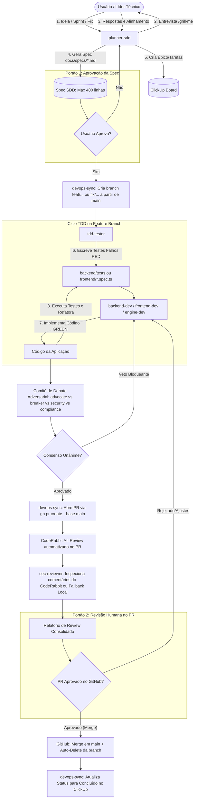

# Workflow Normativo: Ciclo SDD + TDD com Squad de IA

Este documento orienta o fluxo ponta a ponta de desenvolvimento orientado a especificações e testes (**SDD + TDD**) no projeto **SIGAAS**.

---

## Diagrama do Ciclo de Desenvolvimento



---

## Passo a Passo Operacional

### Etapa 1: Planejamento & SDD (`planner-sdd`)
1. O usuário inicia a sessão descrevendo o objetivo da Sprint ou da tarefa.
2. O agente ativa `/grill-me`, questionando detalhes de arquitetura, contratos de API, cenários e critérios de aceite um por um.
3. É gerado o arquivo `docs/specs/sprintX-<nome>.md` seguindo o template oficial, garantindo que o escopo caiba em **no máximo 300 a 400 linhas de código**.
4. O agente executa:
   ```bash
   python scripts/clickup_sync.py sync-spec docs/specs/sprintX-<nome>.md
   ```
5. **Gate 1**: O usuário aprova a spec.

### Etapa 2: Criação da Branch e Red Phase do TDD (`devops-sync` e `tdd-tester`)
1. O agente cria a branch semântica a partir de `main`:
   ```bash
   git checkout main
   git pull origin main
   git checkout -b feat/<nome-da-tarefa>
   ```
2. Baseado nos critérios de aceite em Gherkin da Spec, o agente `tdd-tester` cria os testes automatizados correspondentes.
3. Os testes são executados e devem falhar com clareza:
   ```bash
   pytest backend/tests/test_<feature>.py
   ```
4. O status da tarefa no ClickUp é atualizado para `Em andamento`.

### Etapa 3: Green & Refactor (`backend-dev`, `frontend-dev`, `engine-dev`)
1. O desenvolvedor implementa a rota FastAPI, o modelo de banco ou o componente Angular necessário.
2. A suíte de testes é reexecutada até ficar 100% verde:
   ```bash
   pytest
   ```
3. Refatoração de código mantendo os testes passando e aderindo aos padrões PEP 8 / TypeScript.

### Etapa 4: Debate Adversarial Multi-Agente Pré-PR (`sec-reviewer` e Comitê)
1. O `sec-reviewer` dispara o comitê dialético concorrente via `invoke_subagent` (`.agent/workflows/adversarial-debate.md`):
   - `advocate-mapper` (mapeia implementações e formula defesa)
   - `adversary-breaker` (ataca casos de borda e concorrência)
   - `adversary-security` (ataca segurança e multi-tenancy)
   - `adversary-compliance` (fiscaliza as 10 regras de AGENTS.md e diff <= 400)
2. Se houver qualquer veto fundamentado, a tarefa retorna imediatamente ao desenvolvedor para correção antes de chamar o humano.
3. O árbitro consolida o parecer e emite **Consenso Unânime**.

### Etapa 5: Abertura do Pull Request e Review Complementar (`devops-sync`)
1. O commit é gerado na branch com Conventional Commits:
   ```bash
   git add .
   git commit -m "feat(<escopo>): breve descrição da funcionalidade"
   git push origin feat/<nome-da-tarefa>
   ```
2. O agente abre o Pull Request mirando `main`:
   ```bash
   gh pr create --base main --title "feat(<escopo>): breve descrição" --body-file .github/pull_request_template.md
   ```
3. O **CodeRabbit AI** analisa o PR no GitHub e deixa comentários linha a linha.
4. O agente `sec-reviewer` inspeciona os comentários do CodeRabbit via `gh pr view --comments`. Caso o CodeRabbit esteja bloqueado por *rate limit*, o relatório do debate adversarial local supre a auditoria externa.

### Etapa 6: Gate 2 Humano, Merge e Auto-Delete
1. Você revisa o PR no GitHub com o parecer consolidado e autoriza o **Merge**.
2. O GitHub automaticamente deleta a branch efêmera (*auto-delete*).
3. O agente atualiza o ClickUp para `Concluído`:
   ```bash
   python scripts/clickup_sync.py update-status --task-id <ID> --status "Concluído"
   ```
