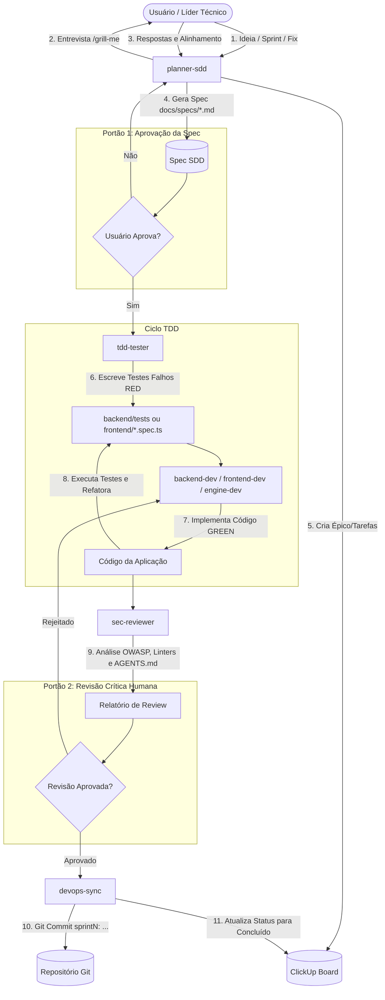

# Workflow Normativo: Ciclo SDD + TDD com Squad de IA

Este documento orienta o fluxo ponta a ponta de desenvolvimento orientado a especificações e testes (**SDD + TDD**) no projeto **SIGAAS**.

---

## Diagrama do Ciclo de Desenvolvimento



---

## Passo a Passo Operacional

### Etapa 1: Planejamento & SDD (`planner-sdd`)
1. O usuário inicia a sessão descrevendo o objetivo da Sprint ou da tarefa.
2. O agente ativa `/grill-me`, questionando detalhes de arquitetura, contratos de API, cenários e critérios de aceite um por um.
3. É gerado o arquivo `docs/specs/sprintX-<nome>.md` seguindo o template oficial.
4. O agente executa:
   ```bash
   python scripts/clickup_sync.py sync-spec docs/specs/sprintX-<nome>.md
   ```
5. **Gate 1**: O usuário aprova a spec.

### Etapa 2: Red Phase do TDD (`tdd-tester`)
1. Baseado nos critérios de aceite em Gherkin da Spec, o agente cria os testes automatizados correspondentes.
2. Os testes são executados e devem falhar com clareza:
   ```bash
   pytest backend/tests/test_<feature>.py
   ```
3. O status da tarefa no ClickUp é atualizado para `Em andamento`.

### Etapa 3: Green & Refactor (`backend-dev`, `frontend-dev`, `engine-dev`)
1. O desenvolvedor implementa a rota FastAPI, o modelo de banco ou o componente Angular necessário.
2. A suíte de testes é reexecutada até ficar 100% verde:
   ```bash
   pytest
   ```
3. Refatoração de código mantendo os testes passando e aderindo aos padrões PEP 8 / TypeScript.

### Etapa 4: Auditoria de Segurança e Qualidade (`sec-reviewer`)
1. Análise de vulnerabilidades:
   - Checagem de injeção SQL, integridade de tokens JWT, validação rigorosa com Pydantic.
   - Verificação das regras invioláveis do `AGENTS.md`.
2. O auditor reporta as constatações para o usuário.

### Etapa 5: Gate 2 & DevOps (`devops-sync`)
1. O usuário dá a aprovação final.
2. Commit é realizado no padrão do repositório:
   ```bash
   git add .
   git commit -m "sprintX: breve descrição da funcionalidade"
   ```
3. Atualização do ClickUp para `Concluído`:
   ```bash
   python scripts/clickup_sync.py update-status --task-id <ID> --status "Concluído"
   ```
