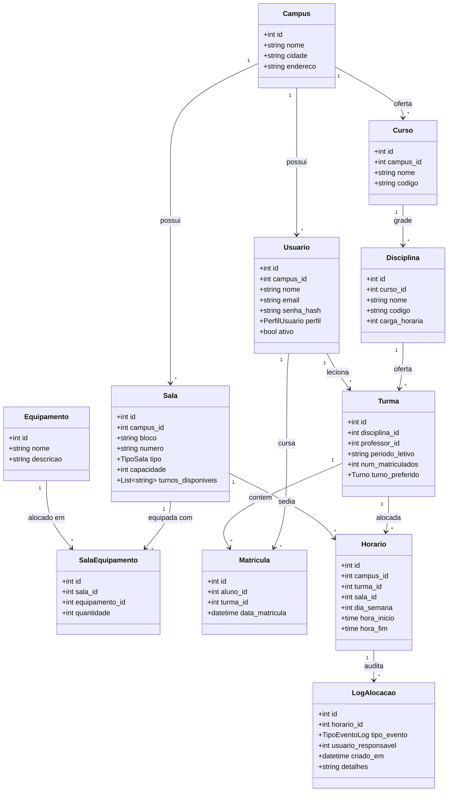
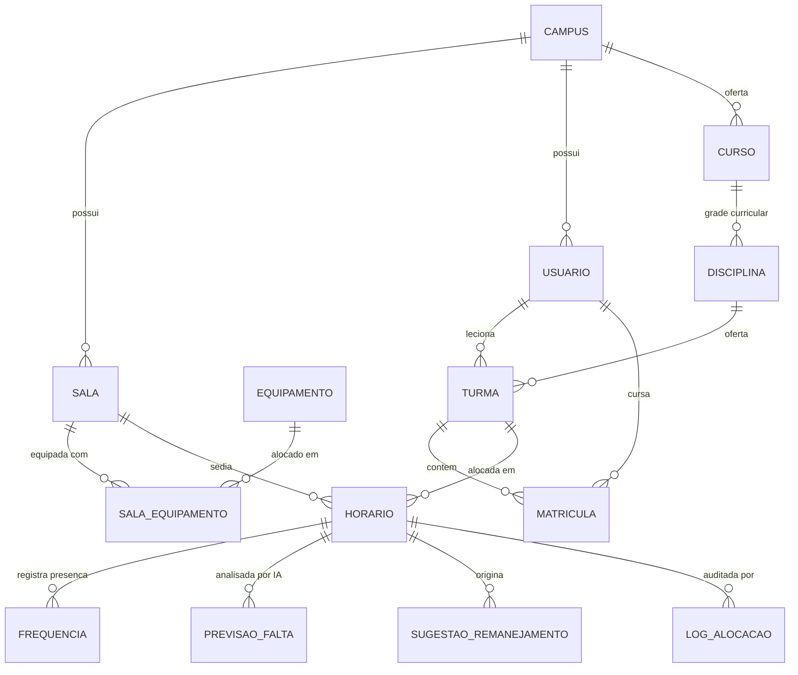

# Relatório Técnico: Sprints 01, 02 e 03
## Sistema Inteligente de Gestão Acadêmica e Alocação de Salas (SIGAAS)
**Disciplina:** Fábrica de Software & Tópicos Avançados em Computação  
**Turma:** 8MB - CC  
**Equipe:** Grupo 31 — SIGAAS  
**Entrega:** Sprint 03 — Estrutura Inicial Funcional (com Sprints 01 e 02 anteriores)  
**Data-Limite de Entrega:** 19 de Setembro de 2026  
**Repositório Oficial no GitHub:** [https://github.com/ValdVdC/Fabrica-de-Software-Gerenciador-de-salas](https://github.com/ValdVdC/Fabrica-de-Software-Gerenciador-de-salas)  

---

### 1. Identificação da Equipe e Distribuição de Papéis

| Integrante | Matrícula | Papel no Squad | Responsabilidade Técnica Principal |
| :--- | :---: | :--- | :--- |
| **Ewerton Thyago Tavares da Silva** | 01573977 | Scrum Master (Líder) | Facilitação ágil, gestão de entregas, governança de branches e submissão no Teams |
| **Wesclei Batista Da Cruz Júnior** | 01606772 | Product Owner | Levantamento de requisitos, regras de negócio e validação dos critérios de aceite |
| **Osvaldo Vasconcelos de Carvalho** | 01614171 | Dev Backend / Sistemas | Arquitetura de API, integração FFI C/OpenMP (`ctypes`), endpoints e migrations |
| **Gabriel Porfírio dos Santos** | 01591399 | Dev Frontend | Interface SPA Angular 20, componentes, estados reativos e interceptors |
| **Flávio Vecch de Brito Farias** | 01600988 | DBA & Documentação | Modelagem relacional PostgreSQL, scripts de seed, integridade e documentação técnica |

---

# PARTE 1 — SPRINT 01: PLANEJAMENTO DO PROJETO (ANTERIOR)

## 1.1 Escolha do Tema
Desenvolvimento de um sistema multi-campus de gestão acadêmica focado na alocação inteligente de salas e horários, integrando módulos de otimização matemática e inteligência artificial.

## 1.2 Definição do Problema
A gestão de horários e espaços físicos em instituições de ensino complexas enfrenta desafios que dificultam a operação diária:
- O controle de alocação muitas vezes é ineficiente, direcionando turmas pequenas para salas grandes ou alocando disciplinas práticas em espaços sem os equipamentos adequados.
- A montagem da grade horária é um processo matemático complexo, propício a falhas humanas como o choque de horários entre turmas e professores.
- Existe um desperdício contínuo de espaço físico quando turmas com histórico de alto índice de evasão ou faltas mantêm grandes auditórios ou salas regulares bloqueadas sem real necessidade.
- O remanejamento de salas de última hora gera confusão e não possui um fluxo sistêmico claro de registro e auditoria.
- Isso gera atrasos na liberação de semestres letivos, subutilização de infraestrutura e insatisfação no corpo docente e discente.

## 1.3 Objetivos do Sistema
- **Objetivo Geral**: Desenvolver uma plataforma multi-tenant que centralize a gestão acadêmica, automatizando a alocação de turmas.
- **Objetivos Específicos**:
  - Alocar turmas de forma automática respeitando capacidade, turnos, tipo de sala e necessidade de equipamentos.
  - Garantir matematicamente a ausência de conflitos de horários.
  - Prever a probabilidade de baixa frequência em aulas específicas utilizando Machine Learning.
  - Sugerir o remanejamento proativo de salas baseado na predição da IA, submetendo a ação à aprovação humana.
  - Garantir a divisão clara de acessos e permissões por perfil.

## 1.4 Público-Alvo
A comunidade acadêmica dividida em quatro perfis de acesso: Admin/Coordenação, Secretaria, Professor e Aluno. O uso engloba desde a coordenação (que gerencia e aprova o fluxo pesado) até o aluno final, que consome o resultado do sistema (sua grade de horários).

## 1.5 Requisitos Funcionais (RF)

| Código | Descrição |
| :--- | :--- |
| **RF01** | Cadastrar, editar e listar campi, salas, equipamentos e cursos. |
| **RF02** | Cadastrar disciplinas, criar turmas e registrar a matrícula de alunos. |
| **RF03** | Autenticar usuários e redirecionar para interfaces isoladas por perfil de acesso. |
| **RF04** | Executar o cálculo de alocação (horário × sala × turma) automaticamente via motor de otimização. |
| **RF05** | Registrar a frequência diária dos alunos para alimentar o modelo de IA. |
| **RF06** | Gerar sugestões automáticas de remanejamento de sala quando a previsão de faltas for alta. |
| **RF07** | Permitir que o perfil Admin/Coordenação aprove ou rejeite as sugestões de remanejamento. |
| **RF08** | Consultar a grade de horários formatada por perfil (Minhas aulas como Professor ou Aluno). |
| **RF09** | Gerar log e trilha de auditoria para registros de alocação e alterações. |

## 1.6 Requisitos Não Funcionais (RNF)

| Código | Descrição |
| :--- | :--- |
| **RNF01** | Interface web responsiva desenvolvida em Angular. |
| **RNF02** | Backend, regras de negócio e orquestração de APIs desenvolvidos em Python (FastAPI*). |
| **RNF03** | O motor de alocação deve ser desenvolvido em C, compilado como `.so` e integrado ao Python via `ctypes`. |
| **RNF04** | O modelo de Inteligência Artificial preditivo deve utilizar Python com scikit-learn. |
| **RNF05** | O banco de dados para persistência relacional e confiável deve ser o PostgreSQL. |
| **RNF06** | O controle de versão do código deve ser obrigatoriamente mantido no Git/GitHub. |
| **RNF07** | A busca de alocação deve rodar em processamento paralelo para redução de tempo, utilizando OpenMP. |

*\*Nota de Refinamento Técnico*: Conforme previsto nas orientações de arquitetura, o framework backend foi evoluído de Django para FastAPI visando execução assíncrona de alto desempenho, documentação OpenAPI interativa nativa (`/docs`) e comunicação de baixa latência em memória via `ctypes` com o motor em C.

## 1.7 Casos de Uso Principais
- **UC01**: Realizar Login e rotear por perfil institucional
- **UC02**: Cadastrar Campus, Sala e Curso (Secretaria/Admin)
- **UC03**: Matricular aluno em Turma (Secretaria)
- **UC04**: Executar alocação otimizada de horários (Admin)
- **UC05**: Visualizar grade horária individual (Professor/Aluno)
- **UC06**: Sugerir remanejamento baseado em predição (Sistema/IA)
- **UC07**: Aprovar ou Rejeitar sugestão de remanejamento (Admin/Coordenação)

---

## 1.8 Atendimento à Devolutiva da Banca (Sprint 01)

> **Parecer da Banca**: *"Projeto muito bem estruturado e com diferencial técnico claro. Incluam as datas das sprints e definam métricas para comparar o desempenho sequencial × OpenMP. Coerência: Adequado, proposta muito bem alinhada, com IA, otimização matemática e paralelismo em OpenMP integrados ao problema. Critérios de Entrega: Atendeu, todos os itens foram apresentados, incluindo GitHub; faltam apenas datas no cronograma e métricas para avaliar o ganho do paralelismo."*

### 1.8.1 Cronograma Oficial com Datas das Sprints

| Sprint | Data-Limite | Marco Avaliativo | Escopo Principal no SIGAAS |
| :--- | :---: | :--- | :--- |
| **Sprint 01** | Concluída | Planejamento Inicial | Tema, requisitos, formação de equipe e repositório GitHub. |
| **Sprint 02** | 19/09 | Arquitetura e Modelagem | Arquitetura do sistema, Classes, MER, Relacional, Protótipo e Banco criado. |
| **Sprint 03** | 19/09 | Estrutura Inicial Funcional | Conexão PostgreSQL, login com autenticação, perfis RBAC, CRUD e deploy local. |
| **Sprint 04** | 26/09 | Primeiro Módulo Completo | Módulo operacional integrado (Salas, Cursos, Turmas, Matrículas e Grade). |
| **Sprint 05** | 03/10 | Segundo Módulo Funcional | Algoritmo de alocação em C com OpenMP, Speedup e integração `ctypes`. |
| **Sprint 06** | 17/10 | Aprimoramento e IA | Ajustes da Pré-Banca, modelo preditivo scikit-learn e remanejamento. |
| **Sprint 07** | 24/10 | Sistema Quase Completo | Dashboard de indicadores, relatórios, filtros e trilha de auditoria. |
| **Sprint 08** | 31/10 | Sistema Praticamente Concluído | Usabilidade refinada, revisão de regras e permissões multi-campus. |
| **Sprint 09** | 07/11 | Testes Completos | Testes funcionais, validação, cobertura >= 85% e saneamento de bugs. |
| **Sprint 10** | 14/11 | Release Candidate | Sistema estabilizado, OpenAPI/Swagger e README atualizado. |
| **Sprint 11** | 21/11 | Preparação para Entrega | Manual do Usuário, Manual Técnico e code review completo. |
| **Sprint 12** | 28/11 | Versão Final e Vídeos | Code Freeze, produção do vídeo no YouTube (16:9) e Instagram (9:16). |
| **Entrega Final**| 05/12 | Envio Definitivo no Teams | Submissão final sem prorrogação. |

---

### 1.8.2 Métricas Científicas para Comparação Sequencial × OpenMP
Para atender ao critério de rigor científico de Tópicos Avançados, a avaliação experimental do motor de alocação em C é regida por:

1. **Tempo de Execução ($T$)**:
   - $T_s$: Tempo sequencial puro com 1 thread.
   - $T_p(k)$: Tempo paralelo com $k \in \{1, 2, 4, 8\}$ threads OpenMP.
   - Instrumentação via `omp_get_wtime()`, calculando média e desvio padrão em 10 repetições por cenário.

2. **Speedup Experimental ($S_k$)**:
   $$S_k = \frac{T_s}{T_p(k)}$$

3. **Eficiência Computacional ($E_k$)**:
   $$E_k = \frac{S_k}{k} \times 100\%$$

4. **Fração Paralelizável Teórica (Lei de Amdahl)**:
   $$S_{\max} = \frac{1}{(1 - f) + \frac{f}{k}}$$
   *Onde $f$ representa a fração do algoritmo de busca paralelizada entre as threads.*

5. **Cenários de Carga de Benchmark**:
   - **Pequeno (Funcional)**: 20 turmas $\times$ 10 salas.
   - **Médio (Operacional)**: 100 turmas $\times$ 40 salas com restrições mistas de equipamentos.
   - **Stress (Escala Computacional)**: 500 turmas $\times$ 150 salas com restrições densas de turno.

---

# PARTE 2 — SPRINT 02: ARQUITETURA E MODELAGEM DO SISTEMA (ANTERIOR)

## 2.1 Arquitetura do Sistema

A arquitetura adota separação em camadas desacopladas com isolamento estrito:

```
[ Navegador Web ]
       │
       ▼ (HTTP / JSON / Porta 4200)
┌────────────────────────────────────────────────────────┐
│               Frontend SPA: Angular 20                 │
│  - Reactive Forms, Signals e Guards de Rota (RBAC)     │
│  - Interceptor HTTP com injeção automática de JWT     │
│  - Nginx como Web Server e Proxy Reverso               │
└──────────────────────────┬─────────────────────────────┘
                           │ (Proxy /api/v1/ na porta 8000)
                           ▼
┌────────────────────────────────────────────────────────┐
│               Backend API: FastAPI (Python)            │
│  - Autenticação e Autorização (Bcrypt + JWT)           │
│  - Multi-tenancy lógico por campus_id                  │
│  - Dependency Injection (SQLAlchemy 2.0 Session Pool)  │
│  - Endpoints REST documentados automaticamente (OpenAPI)│
└──────────────┬──────────────────────────┬──────────────┘
               │ (Carregamento ctypes)    │ (TCP / Porta 5432)
               ▼                          ▼
┌──────────────────────────┐   ┌─────────────────────────┐
│ Motor C + OpenMP (.so)   │   │  Banco de Dados         │
│ - Busca de Alocação      │   │  PostgreSQL 16          │
│ - Paralelismo Multi-Core │   │  - 14 Tabelas DDL       │
│ - Zero dependência externa│  │  - Migrations Alembic   │
└──────────────────────────┘   └─────────────────────────┘
```

---

## 2.2 Diagrama de Classes



---

## 2.3 Modelo Entidade-Relacionamento (MER Conceitual)

### Diagrama Conceitual Entidade-Relacionamento (Notação Crow's Foot)



### Descrição das Entidades e Regras de Cardinalidade:
- **CAMPUS**: Entidade que ancora o isolamento multi-tenant do sistema (`(1,n)` com Sala, Usuario e Curso).
- **USUARIO**: Representa os atores do sistema, classificados pelo discriminador `perfil` (`admin`, `coordenador`, `secretaria`, `professor`, `aluno`).
- **SALA**: Representa os espaços físicos do campus. Possui relacionamento `(n,m)` com **EQUIPAMENTO** através da entidade associativa **SALA_EQUIPAMENTO**.
- **CURSO & DISCIPLINA**: Estruturam a oferta acadêmica institucional.
- **TURMA**: Instância letiva de uma disciplina em um período específico, vinculada a um professor e associada a múltiplos alunos via **MATRICULA**.
- **HORARIO**: Entidade central de alocação que vincula uma Turma a uma Sala em um dia da semana (`0=Segunda` a `5=Sábado`) e intervalo de horas.
- **LOG_ALOCACAO**: Trilha de auditoria imutável que registra todas as alterações de sala com carimbo de tempo e usuário responsável.

---

## 2.4 Modelo Relacional

O esquema físico foi implementado em PostgreSQL com 14 tabelas normalizadas até a Terceira Forma Normal (3FN):

1. `campi` (**id** PK, nome VARCHAR(150), cidade VARCHAR(100), endereco VARCHAR(255), criado_em TIMESTAMP)
2. `usuarios` (**id** PK, campus_id FK, nome VARCHAR(150), email VARCHAR(255) UNIQUE, senha_hash VARCHAR(255), perfil VARCHAR(20), ativo BOOLEAN, criado_em TIMESTAMP)
3. `equipamentos` (**id** PK, nome VARCHAR(100) UNIQUE, descricao TEXT, criado_em TIMESTAMP)
4. `salas` (**id** PK, campus_id FK, bloco VARCHAR(20), numero VARCHAR(20), tipo VARCHAR(30), capacidade INT, turnos_disponiveis JSON, criado_em TIMESTAMP, UNIQUE(campus_id, bloco, numero))
5. `sala_equipamentos` (**id** PK, sala_id FK, equipamento_id FK, quantidade INT, UNIQUE(sala_id, equipamento_id))
6. `cursos` (**id** PK, campus_id FK, nome VARCHAR(150), codigo VARCHAR(20), criado_em TIMESTAMP, UNIQUE(campus_id, codigo))
7. `disciplinas` (**id** PK, curso_id FK, nome VARCHAR(150), codigo VARCHAR(20), carga_horaria INT, criado_em TIMESTAMP, UNIQUE(curso_id, codigo))
8. `turmas` (**id** PK, disciplina_id FK, professor_id FK, periodo_letivo VARCHAR(10), num_matriculados INT, turno_preferido VARCHAR(20), criado_em TIMESTAMP)
9. `matriculas` (**id** PK, aluno_id FK, turma_id FK, data_matricula TIMESTAMP, UNIQUE(aluno_id, turma_id))
10. `horarios` (**id** PK, campus_id FK, turma_id FK, sala_id FK, dia_semana INT, hora_inicio TIME, hora_fim TIME, criado_em TIMESTAMP)
11. `frequencias` (**id** PK, matricula_id FK, horario_id FK, data DATE, presente BOOLEAN, criado_em TIMESTAMP)
12. `previsoes_falta` (**id** PK, turma_id FK, horario_id FK, data_prevista DATE, prob_ausencia NUMERIC(4,3), versao_modelo VARCHAR(50), criado_em TIMESTAMP)
13. `sugestoes_remanejamento` (**id** PK, horario_id FK, sala_atual_id FK, sala_sugerida_id FK, motivo TEXT, status VARCHAR(20), aprovado_por FK, criado_em TIMESTAMP)
14. `logs_alocacao` (**id** PK, horario_id FK, tipo_evento VARCHAR(30), usuario_responsavel FK, timestamp TIMESTAMP, detalhes TEXT)

---

## 2.5 Protótipos das Telas Principais

A interface web foi concebida por perfil de acesso no padrão design system institucional. Abaixo constam os esquemas visuais dos protótipos e o link de acesso ao projeto no Figma:

### 1. Tela de Autenticação (`/login`)
```
┌────────────────────────────────────────────────────────┐
│               SIGAAS - Gestão Acadêmica                │
│                                                        │
│   E-mail: [ admin@sigaas.edu                         ] │
│   Senha:  [ ••••••••••••                             ] │
│                                                        │
│   [                  Entrar no SIGAAS                ] │
│                                                        │
│   Acesso Rápido de Teste:                              │
│   [ Admin ]   [ Coordenação ]   [ Professor ]  [ Aluno]│
└────────────────────────────────────────────────────────┘
```

### 2. Painel do Administrador (`/admin`)
```
┌────────────────────────────────────────────────────────┐
│ SIGAAS | Painel Administrativo             Campus: Sul │
│ [ Salas e Espaços ]  [ Campi ]  [ Equipamentos ]       │
│                                                        │
│ Bloco | Sala | Tipo     | Cap. | Turnos     | Ações    │
│ A     | 101  | Regular  | 45   | Mat/Not    | [Editar] │
│ B     | Lab2 | Informát | 30   | Vespertino | [Excluir]│
│                                                        │
│ [ + Cadastrar Nova Sala ]   [ + Associar Equipamento ] │
└────────────────────────────────────────────────────────┘
```

### 3. Painel da Secretaria (`/secretaria`)
```
┌────────────────────────────────────────────────────────┐
│ SIGAAS | Gestão Acadêmica da Secretaria                │
│ [ Cursos ]  [ Disciplinas ]  [ Turmas ]  [ Matrículas ]│
│                                                        │
│ Código | Disciplina       | Professor    | Vagas | Status│
│ CC101  | Algoritmos I     | Alan Turing  | 42/45 | Ativa │
│ CC204  | Bancos de Dados  | Ada Lovelace | 38/40 | Ativa │
│                                                        │
│ [ + Abrir Nova Turma ]    [ Matricular Alunos em Lote ]│
└────────────────────────────────────────────────────────┘
```

### 4. Painel do Docente (`/professor`)
```
┌────────────────────────────────────────────────────────┐
│ SIGAAS | Grade Horária Semanal - Prof. Alan Turing     │
│                                                        │
│ Horário | Segunda-Feira | Quarta-Feira | Sexta-Feira   │
│ 08:00   | Algoritmos I  | Algoritmos I | Algoritmos I  │
│         | Bloco A - S101| Bloco A - S101| Bloco A - S101│
│                                                        │
│ [ Registrar Frequência ]  [ Solicitar Remanejamento ]  │
└────────────────────────────────────────────────────────┘
```

### 5. Painel do Discente (`/aluno`)
```
┌────────────────────────────────────────────────────────┐
│ SIGAAS | Minha Grade Curricular e Salas                │
│                                                        │
│ Disciplina         | Horário          | Bloco / Sala   │
│ Algoritmos I       | Seg/Qua/Sex 08h  | Bloco A - 101  │
│ Bancos de Dados    | Ter/Qui 10h      | Bloco B - Lab2 │
│                                                        │
│ Frequência Geral: 92% (Regular)                        │
└────────────────────────────────────────────────────────┘
```

### Protótipos e Design System
- **Arquitetura de Telas**: Os protótipos de alta fidelidade foram desenvolvidos diretamente como componentes web standalone no frontend Angular (`frontend/src/app/pages/`) com tokens de design e biblioteca Lucide Icons, seguindo rigorosamente os layouts estruturados acima.
- **Link do Protótipo no Figma**: *(Caso sua equipe possua arquivo compartilhado no Figma, insira o link aqui antes de exportar para PDF)*

---

## 2.6 Banco de Dados Criado
O banco de dados encontra-se plenamente criado através do script de migração versionada do Alembic (`backend/alembic/versions/001_initial_schema.py`), executado no PostgreSQL 16. O schema conta com criação automatizada de tipos ENUM nativos (`perfil_usuario`, `tipo_sala`, `turno`, `status_sugestao`, `tipo_evento_log`) e integridade referencial com chaves estrangeiras declaradas com `ON DELETE CASCADE` ou `ON DELETE RESTRICT`.

---

## 2.7 Projeto Estruturado no GitHub
O repositório oficial adota **Trunk-Based Development**, governança de commits convencionais e CI em 3 estágios:
- **URL**: [https://github.com/ValdVdC/Fabrica-de-Software-Gerenciador-de-salas](https://github.com/ValdVdC/Fabrica-de-Software-Gerenciador-de-salas)
- **Política de Branches**: Nenhuma alteração é enviada diretamente à `main`. Todo trabalho transita por branches semânticas (`feat/*`, `docs/*`, `chore/*`) e Pull Requests avaliados pela esteira automatizada de CI.
- **Squash and Merge Exclusivo**: Repositório travado com `allow_merge_commit=false` e `allow_rebase_merge=false`, garantindo histórico linear e atômico.

---

# PARTE 3 — SPRINT 03: ESTRUTURA INICIAL FUNCIONAL (ATUAL)

## 3.1 Banco de Dados Conectado
A integração entre o FastAPI e o PostgreSQL é realizada via SQLAlchemy 2.0 com pool de conexões assíncronas resilientes (`pool_pre_ping=True`), configurado em `backend/app/db/session.py`.
- **Evidência**: Na inicialização dos containers, o serviço `sigaas_postgres` valida a prontidão através do healthcheck `pg_isready -U gestao_salas -d gestao_salas`.
- **Verificação HTTP**: O endpoint `GET /health` responde `{"status": "ok", "service": "SIGAAS API", "version": "0.1.0"}` confirmando a comunicação operacional entre as camadas.

---

## 3.2 Login Funcional
A autenticação foi implementada em conformidade com o padrão OAuth2 e recomendações OWASP para APIs REST:
- **Endpoint**: `POST /api/v1/auth/login`
- **Payload**: JSON contendo `{"email": "...", "senha": "..."}`
- **Segurança**: Criptografia de senhas via hash `Bcrypt` com salt aleatório (nunca gravando texto plano).
- **Resposta**: Retorno do token `access_token` assinado digitalmente via JWT (`HS256`, validade de 60 minutos) acompanhado dos dados do usuário (`id`, `nome`, `email`, `perfil`, `campus_id`).
- **Endpoint de Sessão**: `GET /api/v1/auth/me` protegido por `HTTPBearer`, permitindo ao cliente Angular revalidar a sessão ativa.

---

## 3.3 Cadastro de Usuários e Persistência

A gestão de usuários e criação de contas institucionais operam com persistência no PostgreSQL e salvaguardas rigorosas de autenticação:
1. **Endpoint Operacional de Cadastro (`POST /api/v1/usuarios`)**:
   - **Autorização RBAC**: Restrito aos perfis `admin`, `coordenador` e `secretaria` via injeção `require_role`.
   - **Criptografia Segura**: Criptografia imediata da senha via algoritmo `Bcrypt` com geração de salt aleatório, garantindo que senhas em texto puro jamais sejam persistidas em disco.
   - **Validações de Domínio**: Verificação de integridade referencial do `campus_id` associado, validação de formato e bloqueio de unicidade de e-mail institucional duplicado com código de retorno `HTTP 409 Conflict`.
   - **Proteção de Dados**: Retorno via schema Pydantic `UsuarioRead`, suprimindo o campo de senha da resposta.

2. **Carga Inicial para Homologação e Testes (Seed Idempotente)**:
   - Script automatizado `scripts/seed_db.py` provisiona 9 usuários de demonstração no banco de dados cobrindo todos os perfis institucionais:
     - Administrador: `admin@sigaas.edu` (senha: `sigaas123`)
     - Coordenador: `coord.cc@sigaas.edu` (senha: `sigaas123`)
     - Secretaria: `secretaria@sigaas.edu` (senha: `sigaas123`)
     - Professores: `professor@sigaas.edu`, `alan.turing@sigaas.edu`, `ada.lovelace@sigaas.edu` (senha: `sigaas123`)
     - Alunos: `aluno@sigaas.edu`, `joao.silva@sigaas.edu`, `maria.souza@sigaas.edu` (senha: `sigaas123`)

---

## 3.4 Controle de Perfis de Acesso (RBAC)
O controle de privilégios opera em dois níveis sincronizados:
1. **Backend (FastAPI)**: As rotas operacionais utilizam a injeção de dependência `require_role(["admin", "coordenador"])` em `backend/app/api/deps.py`. Qualquer tentativa de acesso por perfil não autorizado resulta em código `HTTP 403 Forbidden`.
2. **Frontend (Angular)**: O guarda de rotas `RoleGuard` inspeciona o token decodificado e impede a navegação indevida na SPA, redirecionando o usuário para a interface correspondente ao seu perfil.

---

## 3.5 CRUD Principal Funcionando com Dados Reais

Diferente de protótipos estáticos, o SIGAAS implementa o ciclo completo das quatro operações fundamentais de persistência (**Cadastrar, Consultar, Atualizar e Excluir**) na entidade principal de gestão física (`Sala`), conectado ao PostgreSQL sob isolamento multi-tenant:

1. **Cadastrar (Create)**:
   - **Endpoint**: `POST /api/v1/salas`
   - **Regras**: Validação de unicidade de bloco e número por campus (`HTTP 409 Conflict`), capacidade entre 1 e 5000 alunos e lista tipada de turnos disponíveis.
2. **Consultar (Read)**:
   - **Listagem Geral**: `GET /api/v1/salas` com paginação (`skip`, `limit`) e filtro automático pelo campus de lotação do usuário autenticado.
   - **Consulta Específica**: `GET /api/v1/salas/{sala_id}` com validação de existência e barreira de tenant.
3. **Atualizar (Update)**:
   - **Endpoint**: `PUT /api/v1/salas/{sala_id}`
   - **Regras**: Atualização atômica de bloco, número, tipo, capacidade, turnos disponíveis e status ativo (`ativo: bool`), com recalculo de unicidade para evitar colisões com salas pré-existentes.
4. **Excluir (Delete)**:
   - **Endpoint**: `DELETE /api/v1/salas/{sala_id}`
   - **Salvaguardas**: Verificação de integridade referencial com bloqueio `HTTP 409 Conflict` se houver horários de aula alocados para a sala; exclusão em cascata controlada de vínculos em `sala_equipamentos` antes da remoção física.

### Operações Relacionais Complementares:
- **Vínculo de Equipamentos**: `POST /api/v1/salas/{sala_id}/equipamentos` associando projetores, computadores e kits.
- **Gestão de Matrículas**: `POST /api/v1/matriculas` com controle de concorrência e incremento atômico de vagas ocupadas.
- **Grade Horária Dinâmica**: `GET /api/v1/horarios/meus` filtrando dados por professor ou aluno em sessão.

---

## 3.6 Procedimento de Execução Local (Deploy em 1 Comando)

O ecossistema completo roda em containers Docker interligados em uma rede bridge privada (`sigaas_network`):

### 1. Pré-requisitos
- Docker Engine e Docker Compose instalados.
- Git instalado.

### 2. Passo a Passo de Execução:
```bash
# 1. Clonar o repositório
git clone https://github.com/ValdVdC/Fabrica-de-Software-Gerenciador-de-salas.git
cd Fabrica-de-Software-Gerenciador-de-salas

# 2. Inicializar os containers (PostgreSQL, Backend FastAPI, Frontend Nginx e Cron)
docker compose up -d --build

# 3. Executar as migrações do banco de dados (Alembic)
docker compose exec backend alembic upgrade head

# 4. Popular os dados de teste (Seed)
docker compose exec -w /app backend python /app/../scripts/seed_db.py
# (Ou executar localmente: python scripts/seed_db.py)
```

### 3. URLs de Acesso no Navegador:
- **Frontend SPA (Angular)**: `http://localhost:4200`
- **Documentação Interativa da API (Swagger UI)**: `http://localhost:4200/docs` ou `http://localhost:8000/docs`
- **Status do Motor de Alocação C**: `http://localhost:8000/api/v1/motor/status`

---

## 3.7 Dificuldades Encontradas e Soluções Aplicadas

1. **Compilação C/OpenMP no Container Slim**:
   - *Desafio*: O container Python 3.12 Slim não incluía os cabeçalhos padrão da biblioteca C (`stdio.h`, `libc6-dev`) para compilar `motor_alocacao.so`.
   - *Solução*: Substituição de pacotes avulsos pelo metapacote `build-essential` no `Dockerfile` do backend, garantindo compilação nativa com OpenMP.
2. **Normalização de Final de Linha (CRLF vs LF) e Cache Docker**:
   - *Desafio*: Ambientes Windows geravam quebras de linha CRLF que causavam falhas em scripts shell montados em containers Linux.
   - *Solução*: Configuração de arquivo `.gitattributes` forçando `eol=lf` em scripts e adição de diretivas no Dockerfile.
3. **Limite de Diff por PR**:
   - *Desafio*: Manter cada entrega dentro do limite normativo de no máximo 400 linhas de código modificado por PR.
   - *Solução*: Fatiamento vertical estrito com criação de serviços reativos no frontend em PRs complementares aos endpoints de backend, acompanhado de testes de contrato automatizados.

---

## 3.8 Próximos Passos (Transição para Sprint 04 e 05)
1. **Consolidação das Validações e Relatórios da Sprint 04**: Refinamento de tratamentos de erro e guardas defensivas nos formulários de cadastro.
2. **Desenvolvimento do Algoritmo de Alocação em C (Sprint 05)**: Implementação do algoritmo exato/heurístico de busca de salas sem conflitos em `backend/motor_alocacao/motor_alocacao.c`.
3. **Paralelização OpenMP e Coleta Científica de Speedup**: Medição dos tempos de execução sequencial vs. paralelo com $k \in \{1, 2, 4, 8\}$ threads sob os cenários de carga de 20, 100 e 500 turmas.
