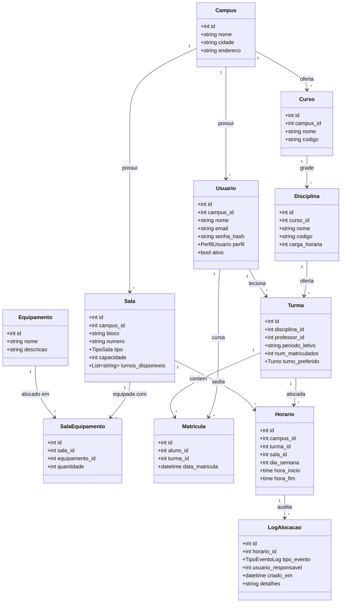

# Relatório Técnico: Sprints 01, 02 e 03
## Sistema Integrado de Gestão Acadêmica, Alocação de Salas e Escalas com IA (SIGAAS)
**Disciplina:** Fábrica de Software & Tópicos Avançados em Computação  
**Entrega:** Sprint 03 — Estrutura Inicial Funcionando (com Sprints 01 e 02 anteriores)  
**Data-Limite:** 19 de Setembro de 2026  
**Repositório Oficial:** [https://github.com/ValdVdC/Fabrica-de-Software-Gerenciador-de-salas](https://github.com/ValdVdC/Fabrica-de-Software-Gerenciador-de-salas)  
**Identificação da Equipe:** Grupo de Desenvolvimento SIGAAS  

---

### Identificação da Equipe e Distribuição de Papéis

| Integrante | Papel no Squad | Responsabilidade Técnica Principal |
| :--- | :--- | :--- |
| **Líder / Scrum Master** | Scrum Master (SM) | Gestão de entregas, facilitação ágil, governança de branches e submissão no Teams |
| **Product Owner** | Product Owner (PO) | Levantamento de requisitos, refinamento de regras de negócio e validação de aceites |
| **Desenvolvedor Backend** | Dev Backend | Arquitetura FastAPI, integração C/OpenMP (`ctypes`), JWT e migrations Alembic |
| **Desenvolvedor Frontend** | Dev Frontend | Interface SPA Angular 20, componentes visuais, serviços reativos e interceptors |
| **Responsável BD & Docs** | DBA / Documentador | Modelagem relacional PostgreSQL, scripts de seed, integridade e documentação técnica |

---

# PARTE 1 — SPRINT 01: CONCEPÇÃO, ESCOPO E REQUISITOS (ANTERIOR)

## 1.1 Apresentação do Problema e Solução Proposta
A alocação de salas e o escalonamento de horários em instituições de ensino superior multi-campus constituem problemas clássicos de otimização combinatória (*Timetabling Problem*, NP-Difícil). Frequentemente, esses processos são conduzidos manualmente por secretarias e coordenações, gerando conflitos de horário, ociosidade de salas especializadas (laboratórios e auditórios) e salas superlotadas.

O **SIGAAS** resolve essa dor estrutural através de uma solução que integra três pilares:
1. **Sistema Web Multi-Perfil**: Gestão acadêmica limpa e distribuída por perfis de acesso (Administrador, Coordenador, Secretaria, Professor e Aluno).
2. **Motor de Otimização Combinatória em C (OpenMP)**: Resolução de conflitos de alocação de salas e turmas com paralelismo de memória compartilhada para alto rendimento computacional.
3. **Módulo de Inteligência Artificial Preditiva (scikit-learn)**: Monitoramento de absenteísmo histórico para sugerir remanejamento inteligente de turmas para salas menores, sob aprovação humana estrita (*Human-in-the-Loop*).

---

## 1.2 Atendimento à Devolutiva da Sprint 01

### 1.2.1 Cronograma com Datas Oficiais das Sprints
Em atendimento ao parecer da banca ("*Incluam as datas das sprints*"), o cronograma acadêmico oficial foi integrado:

| Sprint | Prazo Final | Marco Avaliativo da Disciplina | Entrega no SIGAAS |
| :--- | :---: | :--- | :--- |
| **Sprint 01** | Concluída | Planejamento Inicial e Escopo | Escopo, papéis e repositório GitHub estruturado. |
| **Sprint 02** | 19/09 | Arquitetura e Modelagem | Arquitetura, Classes, MER, Relacional, Protótipo e Banco criado. |
| **Sprint 03** | 19/09 | Estrutura Inicial Funcional | Banco conectado, Login JWT, Perfis RBAC, CRUD principal e Deploy local. |
| **Sprint 04** | 26/09 | Primeiro Módulo Completo | Módulo operacional integrado (Salas, Cursos, Turmas, Matrículas e Grade). |
| **Sprint 05** | 03/10 | Segundo Módulo Funcional | Motor de alocação em C com OpenMP, Speedup e integração `ctypes`. |
| **Sprint 06** | 17/10 | Aprimoramento e IA | Ajustes da Pré-Banca, modelo preditivo de falta e integração. |
| **Sprint 07** | 24/10 | Sistema Quase Completo | Dashboard de indicadores, relatórios, filtros e trilha de auditoria. |
| **Sprint 08** | 31/10 | Sistema Praticamente Concluído | Usabilidade refinada, revisão geral de regras e permissões multi-campus. |
| **Sprint 09** | 07/11 | Testes Completos | Testes funcionais, validações, cobertura >= 85% e saneamento de bugs. |
| **Sprint 10** | 14/11 | Release Candidate | Sistema estável, interface final, OpenAPI/Swagger e README atualizado. |
| **Sprint 11** | 21/11 | Preparação para Entrega | Manual do Usuário, Manual Técnico e code review completo. |
| **Sprint 12** | 28/11 | Versão Final e Vídeos | Code Freeze, produção do vídeo horizontal (YouTube) e vertical (Instagram). |
| **Entrega Final**| 05/12 | Envio Definitivo no Teams | Submissão final sem prorrogação. |

---

### 1.2.2 Métricas Formais para Avaliação do Ganho de Paralelismo (OpenMP vs. Sequencial)
Em atendimento à solicitação ("*definam métricas para comparar o desempenho sequencial × OpenMP*"), a validação científica de Tópicos Avançados será regida pelas seguintes formulações:

1. **Tempo de Execução ($T$)**:
   - $T_s$: Tempo sequencial puro medido com 1 thread.
   - $T_p(k)$: Tempo paralelo medido com $k \in \{1, 2, 4, 8\}$ threads OpenMP.
   - Instrumentação com `omp_get_wtime()`, calculando média e desvio padrão em 10 execuções independentes.

2. **Speedup Experimental ($S_k$)**:
   $$S_k = \frac{T_s}{T_p(k)}$$

3. **Eficiência Computacional ($E_k$)**:
   $$E_k = \frac{S_k}{k} \times 100\%$$

4. **Fração Paralelizável e Limite Teórico (Lei de Amdahl)**:
   $$S_{\max} = \frac{1}{(1 - f) + \frac{f}{k}}$$
   *Onde $f$ representa a fração do código paralelizada pelo algoritmo de busca de alocações.*

5. **Cenários Experimentais de Carga**:
   - **Pequeno (Funcional)**: 20 turmas $\times$ 10 salas.
   - **Médio (Operacional Real)**: 100 turmas $\times$ 40 salas com restrições mistas de equipamentos.
   - **Stress (Escala Computacional)**: 500 turmas $\times$ 150 salas com restrições densas de turno.

---

# PARTE 2 — SPRINT 02: ARQUITETURA E MODELAGEM DO SISTEMA (ANTERIOR)

## 2.1 Arquitetura do Sistema

A arquitetura do SIGAAS adota o padrão em camadas desacopladas com isolamento estrito de responsabilidades:

```
[ Navegador Web ]
       │
       ▼ (HTTP / JSON / Porta 4200)
┌────────────────────────────────────────────────────────┐
│               Frontend SPA: Angular 20                 │
│  - Reactive Forms, Signals e Guards de Rota (RBAC)     │
│  - Interceptor HTTP com injeção automática de JWT     │
│  - Nginx como Web Server e Proxy Reverso               │
└──────────────────────────┬─────────────────────────────┘
                           │ (Proxy /api/v1/ na porta 8000)
                           ▼
┌────────────────────────────────────────────────────────┐
│               Backend API: FastAPI (Python)            │
│  - Autenticação e Autorização (Bcrypt + JWT)           │
│  - Multi-tenancy lógico por campus_id                  │
│  - Dependency Injection (SQLAlchemy 2.0 Session Pool)  │
│  - Endpoints REST documentados automaticamente (OpenAPI)│
└──────────────┬──────────────────────────┬──────────────┘
               │ (Carregamento ctypes)    │ (TCP / Porta 5432)
               ▼                          ▼
┌──────────────────────────┐   ┌─────────────────────────┐
│ Motor C + OpenMP (.so)   │   │  Banco de Dados         │
│ - Busca de Alocação      │   │  PostgreSQL 16          │
│ - Paralelismo Multi-Core │   │  - 14 Tabelas DDL       │
│ - Zero dependência externa│  │  - Migrations Alembic   │
└──────────────────────────┘   └─────────────────────────┘
```

### Componentes e Tecnologias:
- **Cliente (SPA)**: Angular 20 com TypeScript, componentes standalone, signals reativos e Tailwind CSS. Nenhuma regra de negócio crítica roda no cliente.
- **Servidor da Aplicação**: FastAPI (Python 3.12). Ponto único de entrada HTTP, orquestrador de chamadas, validador de schemas com Pydantic v2 e controle de sessões.
- **Motor Computacional**: Biblioteca nativa em C (`motor_alocacao.so`) compilada com GCC e flags `-O3 -fopenmp`. Não acessa o banco diretamente; recebe estruturas C em memória via `ctypes` e retorna as alocações computadas.
- **Banco de Dados**: PostgreSQL 16 Alpine, rodando em container Docker dedicado, garantindo integridade referencial com chaves estrangeiras e índices compostos.

---

## 2.2 Diagrama de Classes



---

## 2.3 Modelo Entidade-Relacionamento (MER Conceitual)

- **CAMPUS**: Entidade que ancora o isolamento multi-tenant do sistema (`(1,n)` com Sala, Usuario e Curso).
- **USUARIO**: Representa os atores do sistema, classificados pelo atributo discriminador `perfil` (`admin`, `coordenador`, `secretaria`, `professor`, `aluno`).
- **SALA**: Representa os espaços físicos do campus. Possui relacionamento `(n,m)` com **EQUIPAMENTO** através da entidade associativa **SALA_EQUIPAMENTO**.
- **CURSO & DISCIPLINA**: Estruturam a oferta acadêmica institucional.
- **TURMA**: Instância letiva de uma disciplina em um período específico, vinculada a um professor e associada a múltiplos alunos via **MATRICULA**.
- **HORARIO**: Entidade central de alocação que vincula uma Turma a uma Sala em um dia da semana (`0=Segunda` a `5=Sábado`) e intervalo de horas.
- **SUGESTAO_REMANEJAMENTO & PREVISAO_FALTA**: Entidades preditivas reservadas para o job de IA.
- **LOG_ALOCACAO**: Trilha de auditoria imutável que registra todas as alterações de sala com carimbo de tempo e usuário responsável.

---

## 2.4 Modelo Relacional

O esquema físico foi implementado em PostgreSQL com 14 tabelas normalizadas até a Terceira Forma Normal (3FN):

1. `campi` (**id** PK, nome VARCHAR(150), cidade VARCHAR(100), endereco VARCHAR(255), criado_em TIMESTAMP)
2. `usuarios` (**id** PK, campus_id FK, nome VARCHAR(150), email VARCHAR(255) UNIQUE, senha_hash VARCHAR(255), perfil VARCHAR(20), ativo BOOLEAN, criado_em TIMESTAMP)
3. `equipamentos` (**id** PK, nome VARCHAR(100) UNIQUE, descricao TEXT, criado_em TIMESTAMP)
4. `salas` (**id** PK, campus_id FK, bloco VARCHAR(20), numero VARCHAR(20), tipo VARCHAR(30), capacidade INT, turnos_disponiveis JSON, criado_em TIMESTAMP, UNIQUE(campus_id, bloco, numero))
5. `sala_equipamentos` (**id** PK, sala_id FK, equipamento_id FK, quantidade INT, UNIQUE(sala_id, equipamento_id))
6. `cursos` (**id** PK, campus_id FK, nome VARCHAR(150), codigo VARCHAR(20), criado_em TIMESTAMP, UNIQUE(campus_id, codigo))
7. `disciplinas` (**id** PK, curso_id FK, nome VARCHAR(150), codigo VARCHAR(20), carga_horaria INT, criado_em TIMESTAMP, UNIQUE(curso_id, codigo))
8. `turmas` (**id** PK, disciplina_id FK, professor_id FK, periodo_letivo VARCHAR(10), num_matriculados INT, turno_preferido VARCHAR(20), criado_em TIMESTAMP)
9. `matriculas` (**id** PK, aluno_id FK, turma_id FK, data_matricula TIMESTAMP, UNIQUE(aluno_id, turma_id))
10. `horarios` (**id** PK, campus_id FK, turma_id FK, sala_id FK, dia_semana INT, hora_inicio TIME, hora_fim TIME, criado_em TIMESTAMP)
11. `frequencias` (**id** PK, matricula_id FK, horario_id FK, data DATE, presente BOOLEAN, criado_em TIMESTAMP)
12. `previsoes_falta` (**id** PK, turma_id FK, horario_id FK, data_prevista DATE, prob_ausencia NUMERIC(4,3), versao_modelo VARCHAR(50), criado_em TIMESTAMP)
13. `sugestoes_remanejamento` (**id** PK, horario_id FK, sala_atual_id FK, sala_sugerida_id FK, motivo TEXT, status VARCHAR(20), aprovado_por FK, criado_em TIMESTAMP)
14. `logs_alocacao` (**id** PK, horario_id FK, tipo_evento VARCHAR(30), usuario_responsavel FK, timestamp TIMESTAMP, detalhes TEXT)

---

## 2.5 Protótipos das Telas Principais

A interface foi concebida e prototipada em componentes web modernos por perfil de acesso:
1. **Tela de Autenticação (`/login`)**: Formulário centralizado com validação em tempo real de e-mail e senha, suporte a feedback de erro sem enumeração de usuários e botões de atalho de demonstração para os 4 perfis.
2. **Painel do Administrador (`/admin`)**: Sistema em abas contextuais ("Salas e Espaços", "Campi", "Equipamentos"), contadores de capacidade e formulários modais de cadastro rápido.
3. **Painel da Secretaria (`/secretaria`)**: Gestão de ofertas com 4 abas integradas ("Cursos", "Disciplinas", "Turmas", "Matrículas"), exibindo métricas consolidadas de inscritos em tempo real.
4. **Painel do Docente (`/professor`)**: Grade Horária Semanal formatada em matriz visual de segunda a sábado com destaque para código da disciplina, bloco e sala alocada.
5. **Painel do Discente (`/aluno`)**: Grade Horária personalizada com localização de salas e indicação clara de turnos.

---

## 2.6 Banco de Dados Criado
O banco de dados encontra-se plenamente criado através do script de migração versionada do Alembic (`backend/alembic/versions/001_initial_schema.py`), executado no PostgreSQL 16. O schema conta com criação automatizada de tipos ENUM nativos (`perfil_usuario`, `tipo_sala`, `turno`, `status_sugestao`, `tipo_evento_log`) e integridade referencial com chaves estrangeiras declaradas com `ON DELETE CASCADE` ou `ON DELETE RESTRICT`.

---

## 2.7 Projeto Estruturado no GitHub
O repositório oficial adota **Trunk-Based Development**, governança de commits convencionais e CI em 3 estágios:
- **URL**: [https://github.com/ValdVdC/Fabrica-de-Software-Gerenciador-de-salas](https://github.com/ValdVdC/Fabrica-de-Software-Gerenciador-de-salas)
- **Política de Branches**: Nenhuma alteração é enviada diretamente à `main`. Todo trabalho transita por branches semânticas (`feat/*`, `docs/*`, `chore/*`) e Pull Requests avaliados pela esteira automatizada de CI.
- **Squash and Merge Exclusivo**: Repositório travado com `allow_merge_commit=false` e `allow_rebase_merge=false`, garantindo histórico linear e atômico.

---

# PARTE 3 — SPRINT 03: ESTRUTURA INICIAL FUNCIONAL (ATUAL)

## 3.1 Banco de Dados Conectado
A integração entre o FastAPI e o PostgreSQL é realizada via SQLAlchemy 2.0 com pool de conexões assíncronas resilientes (`pool_pre_ping=True`), configurado em `backend/app/db/session.py`.
- **Evidência**: Na inicialização dos containers, o serviço `sigaas_postgres` valida a prontidão através do healthcheck `pg_isready -U gestao_salas -d gestao_salas`.
- **Verificação HTTP**: O endpoint `GET /health` responde `{"status": "ok", "service": "SIGAAS API", "version": "0.1.0"}` confirmando a comunicação operacional entre as camadas.

---

## 3.2 Login Funcional
A autenticação foi implementada em conformidade com o padrão OAuth2 e recomendações OWASP para APIs REST:
- **Endpoint**: `POST /api/v1/auth/login`
- **Payload**: JSON contendo `{"email": "...", "senha": "..."}`
- **Segurança**: Criptografia de senhas via hash `Bcrypt` com salt aleatório (nunca gravando texto plano).
- **Resposta**: Retorno do token `access_token` assinado digitalmente via JWT (`HS256`, validade de 60 minutos) acompanhado dos dados do usuário (`id`, `nome`, `email`, `perfil`, `campus_id`).
- **Endpoint de Sessão**: `GET /api/v1/auth/me` protegido por `HTTPBearer`, permitindo ao cliente Angular revalidar a sessão ativa.

---

## 3.3 Cadastro de Usuários e Persistência
A persistência de usuários suporta múltiplos campi e perfis distintos. O banco de dados conta com script idempotente de seed (`scripts/seed_db.py`) que cadastra 9 usuários de teste cobrindo todos os perfis institucionais:
- Administrador: `admin@sigaas.edu` (senha: `sigaas123`)
- Coordenador: `coord.cc@sigaas.edu` (senha: `sigaas123`)
- Secretaria: `secretaria@sigaas.edu` (senha: `sigaas123`)
- Professores: `professor@sigaas.edu`, `alan.turing@sigaas.edu`, `ada.lovelace@sigaas.edu` (senha: `sigaas123`)
- Alunos: `aluno@sigaas.edu`, `joao.silva@sigaas.edu`, `maria.souza@sigaas.edu` (senha: `sigaas123`)

---

## 3.4 Controle de Perfis de Acesso (RBAC)
O controle de privilégios opera em dois níveis sincronizados:
1. **Backend (FastAPI)**: As rotas operacionais utilizam a injeção de dependência `require_role(["admin", "coordenador"])` em `backend/app/api/deps.py`. Qualquer tentativa de acesso por perfil não autorizado resulta em código `HTTP 403 Forbidden`.
2. **Frontend (Angular)**: O guarda de rotas `RoleGuard` inspeciona o token decodificado e impede a navegação indevida na SPA, redirecionando o usuário para a interface correspondente ao seu perfil.

---

## 3.5 CRUD Principal Funcionando com Dados Reais
Diferente de protótipos visuais estáticos, o SIGAAS implementa operações completas de consulta, criação e relacionamento com persistência no PostgreSQL:
- **Gestão de Espaços (Admin)**: Criação de salas (`POST /api/v1/salas`) com validação de unicidade de bloco e número, controle de capacidade e turnos, e associação de equipamentos.
- **Gestão de Turmas e Matrículas (Secretaria)**: Cadastro de turmas vinculadas a disciplinas e professores, e matrículas de alunos (`POST /api/v1/matriculas`) com incremento atômico do contador `num_matriculados` e bloqueio de duplicidade (código `HTTP 409 Conflict`).
- **Grade Horária Contextual**: Endpoint `GET /api/v1/horarios/meus` que filtra automaticamente horários de aulas atribuídas para professores e turmas matriculadas para alunos.

---

## 3.6 Procedimento de Execução Local (Deploy em 1 Comando)

O ecossistema completo roda em containers Docker interligados em uma rede bridge privada (`sigaas_network`):

### 1. Pré-requisitos
- Docker Engine e Docker Compose instalados.
- Git instalado.

### 2. Passo a Passo de Execução:
```bash
# 1. Clonar o repositório
git clone https://github.com/ValdVdC/Fabrica-de-Software-Gerenciador-de-salas.git
cd Fabrica-de-Software-Gerenciador-de-salas

# 2. Inicializar os containers (PostgreSQL, Backend FastAPI, Frontend Nginx e Cron)
docker compose up -d --build

# 3. Executar as migrações do banco de dados (Alembic)
docker compose exec backend alembic upgrade head

# 4. Popular os dados de teste (Seed)
docker compose exec -w /app backend python /app/../scripts/seed_db.py
# (Ou executar localmente: python scripts/seed_db.py)
```

### 3. URLs de Acesso no Navegador:
- **Frontend SPA (Angular)**: `http://localhost:4200`
- **Documentação Interativa da API (Swagger UI)**: `http://localhost:4200/docs` ou `http://localhost:8000/docs`
- **Status do Motor de Alocação C**: `http://localhost:8000/api/v1/motor/status`

---

## 3.7 Dificuldades Encontradas e Soluções Aplicadas

1. **Compilação C/OpenMP no Container Slim**:
   - *Desafio*: O container Python 3.12 Slim não incluía os cabeçalhos padrão da biblioteca C (`stdio.h`, `libc6-dev`) para compilar `motor_alocacao.so`.
   - *Solução*: Substituição de pacotes avulsos pelo metapacote `build-essential` no `Dockerfile` do backend, garantindo compilação nativa com OpenMP.
2. **Normalização de Final de Linha (CRLF vs LF) e Cache Docker**:
   - *Desafio*: Ambientes Windows geravam quebras de linha CRLF que causavam falhas em scripts shell montados em containers Linux.
   - *Solução*: Configuração de arquivo `.gitattributes` forçando `eol=lf` em scripts e adição de diretivas no Dockerfile.
3. **Limite de Diff por PR**:
   - *Desafio*: Manter cada entrega dentro do limite normativo de no máximo 400 linhas de código modificado por PR.
   - *Solução*: Fatiamento vertical estrito com criação de serviços reativos no frontend em PRs complementares aos endpoints de backend, acompanhado de testes de contrato automatizados.

---

## 3.8 Próximos Passos (Transição para Sprint 04 e 05)
1. **Consolidação das Validações e Relatórios da Sprint 04**: Refinamento de tratamentos de erro e guardas defensivas nos formulários de cadastro.
2. **Desenvolvimento do Algoritmo de Alocação em C (Sprint 05)**: Implementação do algoritmo exato/heurístico de busca de salas sem conflitos em `backend/motor_alocacao/motor_alocacao.c`.
3. **Paralelização OpenMP e Coleta Científica de Speedup**: Medição dos tempos de execução sequencial vs. paralelo com $k \in \{1, 2, 4, 8\}$ threads sob os cenários de carga de 20, 100 e 500 turmas.
