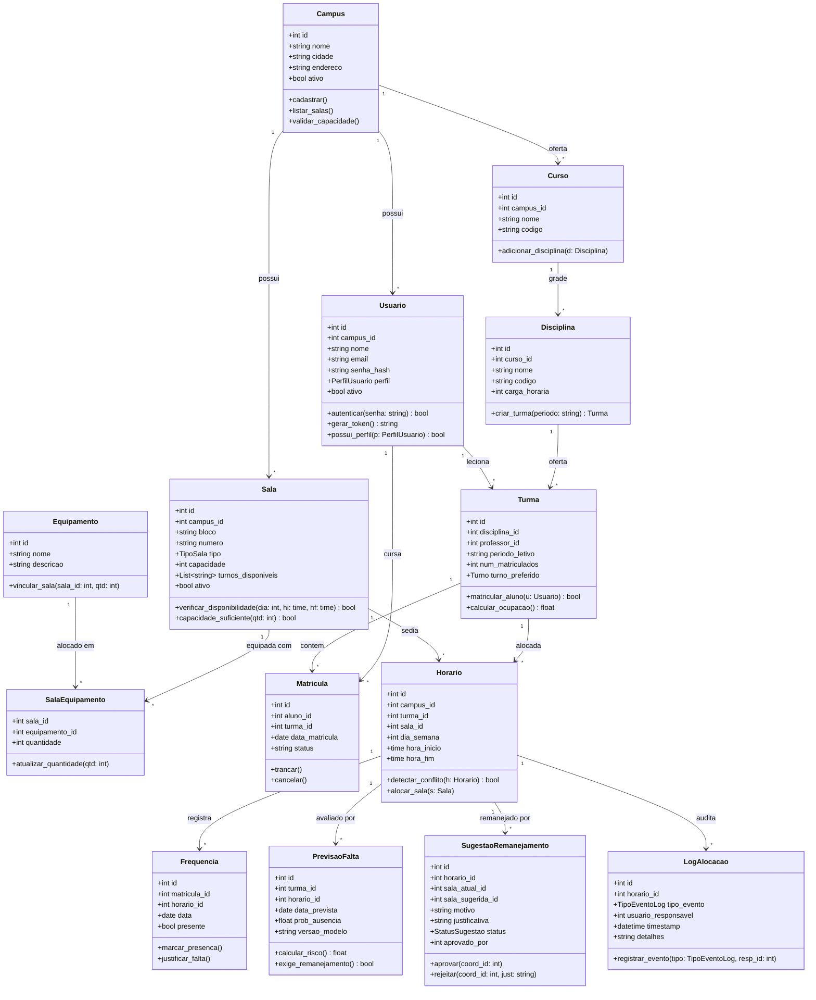
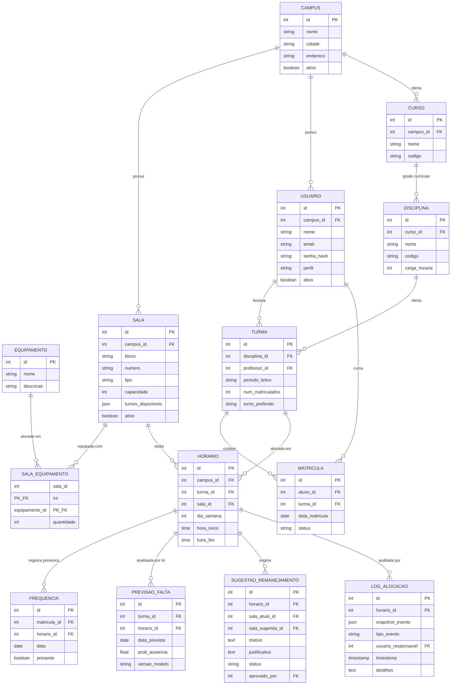
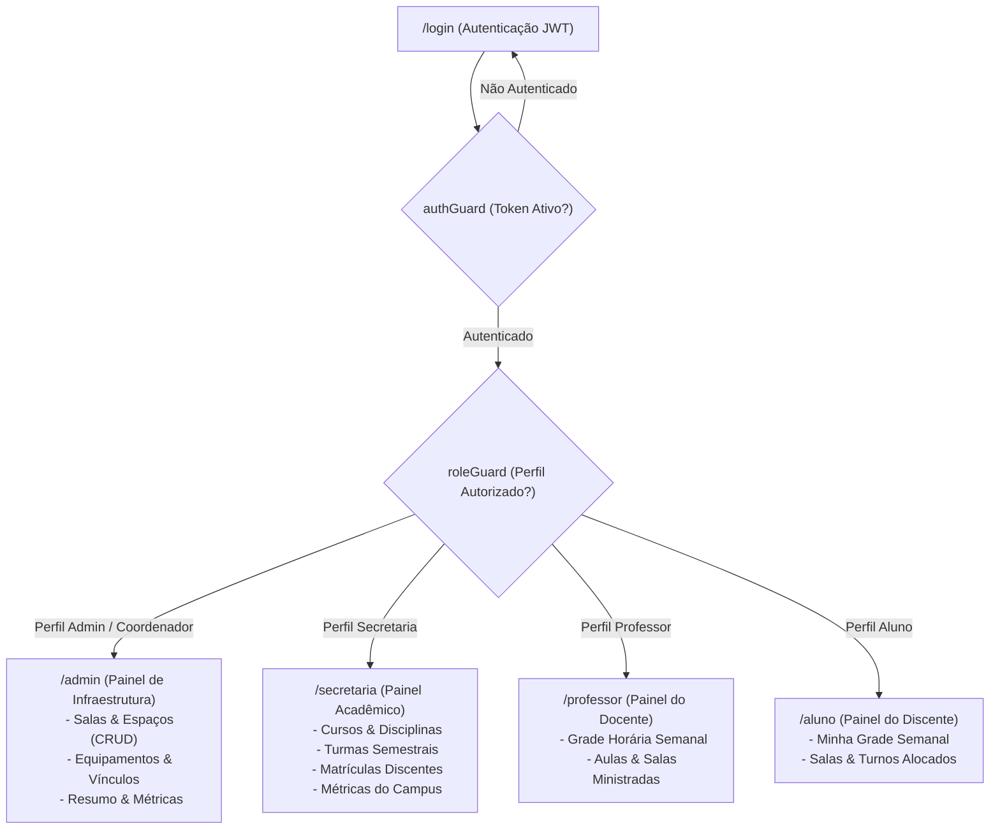

# Relatório Técnico: Sprints 01, 02, 03 e 04
## Sistema Inteligente de Gestão Acadêmica e Alocação de Salas (SIGAAS)
**Disciplina:** Fábrica de Software & Tópicos Avançados em Computação  
**Turma:** 8MB - CC  
**Equipe:** Grupo 31 — SIGAAS  
**Entrega:** Sprint 04 — Primeiro Módulo Completo (com Sprints 01, 02 e 03 anteriores)  
**Data-Limite de Entrega:** 26 de Setembro de 2026  
**Repositório Oficial no GitHub:** [https://github.com/ValdVdC/Fabrica-de-Software-Gerenciador-de-salas](https://github.com/ValdVdC/Fabrica-de-Software-Gerenciador-de-salas)  

---

### 1. Identificação da Equipe e Distribuição de Papéis

| Integrante | Matrícula | Papel no Squad | Responsabilidade Técnica Principal |
| :--- | :---: | :--- | :--- |
| **Ewerton Thyago Tavares da Silva** | 01573977 | Scrum Master (Líder) | Facilitação ágil, gestão de entregas, governança de branches e submissão no Teams |
| **Wesclei Batista Da Cruz Júnior** | 01606772 | Product Owner | Levantamento de requisitos, regras de negócio e validação dos critérios de aceite |
| **Osvaldo Vasconcelos de Carvalho** | 01614171 | Dev Backend / Sistemas | Arquitetura de API, integração FFI C/OpenMP (`ctypes`), endpoints e migrations |
| **Gabriel Porfírio dos Santos** | 01591399 | Dev Frontend | Interface SPA Angular 20, componentes, estados reativos e interceptors |
| **Flávio Vecch de Brito Farias** | 01600988 | DBA & Documentação | Modelagem relacional PostgreSQL, scripts de seed, integridade e documentação técnica |

---

# PARTE 1 — SPRINT 01: PLANEJAMENTO DO PROJETO (ANTERIOR)

## 1.1 Escolha do Tema
Desenvolvimento de um sistema multi-campus de gestão acadêmica focado na alocação inteligente de salas e horários, integrando módulos de otimização matemática e inteligência artificial.

## 1.2 Definição do Problema
A gestão de horários e espaços físicos em instituições de ensino complexas enfrenta desafios que dificultam a operação diária:
- O controle de alocação muitas vezes é ineficiente, direcionando turmas pequenas para salas grandes ou alocando disciplinas práticas em espaços sem os equipamentos adequados.
- A montagem da grade horária é um processo matemático complexo, propício a falhas humanas como o choque de horários entre turmas e professores.
- Existe um desperdício contínuo de espaço físico quando turmas com histórico de alto índice de evasão ou faltas mantêm grandes auditórios ou salas regulares bloqueadas sem real necessidade.
- O remanejamento de salas de última hora gera confusão e não possui um fluxo sistêmico claro de registro e auditoria.
- Isso gera atrasos na liberação de semestres letivos, subutilização de infraestrutura e insatisfação no corpo docente e discente.

## 1.3 Objetivos do Sistema
- **Objetivo Geral**: Desenvolver uma plataforma multi-tenant que centralize a gestão acadêmica, automatizando a alocação de turmas.
- **Objetivos Específicos**:
  - Alocar turmas de forma automática respeitando capacidade, turnos, tipo de sala e necessidade de equipamentos.
  - Garantir matematicamente a ausência de conflitos de horários.
  - Prever a probabilidade de baixa frequência em aulas específicas utilizando Machine Learning.
  - Sugerir o remanejamento proativo de salas baseado na predição da IA, submetendo a ação à aprovação humana.
  - Garantir a divisão clara de acessos e permissões por perfil.

## 1.4 Público-Alvo
A comunidade acadêmica dividida em quatro perfis de acesso: Admin/Coordenação, Secretaria, Professor e Aluno. O uso engloba desde a coordenação (que gerencia e aprova o fluxo pesado) até o aluno final, que consome o resultado do sistema (sua grade de horários).

## 1.5 Requisitos Funcionais (RF)

| Código | Descrição |
| :--- | :--- |
| **RF01** | Cadastrar, editar e listar campi, salas, equipamentos e cursos. |
| **RF02** | Cadastrar disciplinas, criar turmas e registrar a matrícula de alunos. |
| **RF03** | Autenticar usuários e redirecionar para interfaces isoladas por perfil de acesso. |
| **RF04** | Executar o cálculo de alocação (horário × sala × turma) automaticamente via motor de otimização. |
| **RF05** | Registrar a frequência diária dos alunos para alimentar o modelo de IA. |
| **RF06** | Gerar sugestões automáticas de remanejamento de sala quando a previsão de faltas for alta. |
| **RF07** | Permitir que o perfil Admin/Coordenação aprove ou rejeite as sugestões de remanejamento. |
| **RF08** | Consultar a grade de horários formatada por perfil (Minhas aulas como Professor ou Aluno). |
| **RF09** | Gerar log e trilha de auditoria para registros de alocação e alterações. |

## 1.6 Requisitos Não Funcionais (RNF)

| Código | Descrição |
| :--- | :--- |
| **RNF01** | Interface web responsiva desenvolvida em Angular. |
| **RNF02** | Backend, regras de negócio e orquestração de APIs desenvolvidos em Python (FastAPI*). |
| **RNF03** | O motor de alocação deve ser desenvolvido em C, compilado como `.so` e integrado ao Python via `ctypes`. |
| **RNF04** | O modelo de Inteligência Artificial preditivo deve utilizar Python com scikit-learn. |
| **RNF05** | O banco de dados para persistência relacional e confiável deve ser o PostgreSQL. |
| **RNF06** | O controle de versão do código deve ser obrigatoriamente mantido no Git/GitHub. |
| **RNF07** | A busca de alocação deve rodar em processamento paralelo para redução de tempo, utilizando OpenMP. |

*\*Nota de Refinamento Técnico*: Conforme previsto nas orientações de arquitetura, o framework backend foi evoluído de Django para FastAPI visando execução assíncrona de alto desempenho, documentação OpenAPI interativa nativa (`/docs`) e comunicação de baixa latência em memória via `ctypes` com o motor em C.

## 1.7 Casos de Uso Principais
- **UC01**: Realizar Login e rotear por perfil institucional
- **UC02**: Cadastrar Campus, Sala e Curso (Secretaria/Admin)
- **UC03**: Matricular aluno em Turma (Secretaria)
- **UC04**: Executar alocação otimizada de horários (Admin)
- **UC05**: Visualizar grade horária individual (Professor/Aluno)
- **UC06**: Sugerir remanejamento baseado em predição (Sistema/IA)
- **UC07**: Aprovar ou Rejeitar sugestão de remanejamento (Admin/Coordenação)

---

## 1.8 Atendimento à Devolutiva da Banca (Sprint 01)

> **Parecer da Banca**: *"Projeto muito bem estruturado e com diferencial técnico claro. Incluam as datas das sprints e definam métricas para comparar o desempenho sequencial × OpenMP. Coerência: Adequado, proposta muito bem alinhada, com IA, otimização matemática e paralelismo em OpenMP integrados ao problema. Critérios de Entrega: Atendeu, todos os itens foram apresentados, incluindo GitHub; faltam apenas datas no cronograma e métricas para avaliar o ganho do paralelismo."*

### 1.8.1 Cronograma Oficial com Datas das Sprints

| Sprint | Data-Limite | Marco Avaliativo | Escopo Principal no SIGAAS |
| :--- | :---: | :--- | :--- |
| **Sprint 01** | Concluída | Planejamento Inicial | Tema, requisitos, formação de equipe e repositório GitHub. |
| **Sprint 02** | 19/09 | Arquitetura e Modelagem | Arquitetura do sistema, Classes, MER, Relacional, Protótipo e Banco criado. |
| **Sprint 03** | 19/09 | Estrutura Inicial Funcional | Conexão PostgreSQL, login com autenticação, perfis RBAC, CRUD e deploy local. |
| **Sprint 04** | 26/09 | Primeiro Módulo Completo | Módulo operacional integrado (Salas, Cursos, Turmas, Matrículas e Grade). |
| **Sprint 05** | 03/10 | Segundo Módulo Funcional | Algoritmo de alocação em C com OpenMP, Speedup e integração `ctypes`. |
| **Sprint 06** | 17/10 | Aprimoramento e IA | Ajustes da Pré-Banca, modelo preditivo scikit-learn e remanejamento. |
| **Sprint 07** | 24/10 | Sistema Quase Completo | Dashboard de indicadores, relatórios, filtros e trilha de auditoria. |
| **Sprint 08** | 31/10 | Sistema Praticamente Concluído | Usabilidade refinada, revisão de regras e permissões multi-campus. |
| **Sprint 09** | 07/11 | Testes Completos | Testes funcionais, validação, cobertura >= 85% e saneamento de bugs. |
| **Sprint 10** | 14/11 | Release Candidate | Sistema estabilizado, OpenAPI/Swagger e README atualizado. |
| **Sprint 11** | 21/11 | Preparação para Entrega | Manual do Usuário, Manual Técnico e code review completo. |
| **Sprint 12** | 28/11 | Versão Final e Vídeos | Code Freeze, produção do vídeo no YouTube (16:9) e Instagram (9:16). |
| **Entrega Final**| 05/12 | Envio Definitivo no Teams | Submissão final sem prorrogação. |

---

### 1.8.2 Métricas Científicas para Comparação Sequencial × OpenMP
Para atender ao critério de rigor científico de Tópicos Avançados, a avaliação experimental do motor de alocação em C é regida por:

1. **Tempo de Execução ($T$)**:
   - $T_s$: Tempo sequencial puro com 1 thread.
   - $T_p(k)$: Tempo paralelo com $k \in \{1, 2, 4, 8\}$ threads OpenMP.
   - Instrumentação via `omp_get_wtime()`, calculando média e desvio padrão em 10 repetições por cenário.

2. **Speedup Experimental ($S_k$)**:
   $$S_k = \frac{T_s}{T_p(k)}$$

3. **Eficiência Computacional ($E_k$)**:
   $$E_k = \frac{S_k}{k} \times 100\%$$

4. **Fração Paralelizável Teórica (Lei de Amdahl)**:
   $$S_{\max} = \frac{1}{(1 - f) + \frac{f}{k}}$$
   *Onde $f$ representa a fração do algoritmo de busca paralelizada entre as threads.*

5. **Cenários de Carga de Benchmark**:
   - **Pequeno (Funcional)**: 20 turmas $\times$ 10 salas.
   - **Médio (Operacional)**: 100 turmas $\times$ 40 salas com restrições mistas de equipamentos.
   - **Stress (Escala Computacional)**: 500 turmas $\times$ 150 salas com restrições densas de turno.

---

# PARTE 2 — SPRINT 02: ARQUITETURA E MODELAGEM DO SISTEMA (ANTERIOR)

## 2.1 Arquitetura do Sistema

A arquitetura adota separação em camadas desacopladas com isolamento estrito:

```
[ Navegador Web ]
       │
       ▼ (HTTP / JSON / Porta 4200)
┌────────────────────────────────────────────────────────┐
│               Frontend SPA: Angular 20                 │
│  - Reactive Forms, Signals e Guards de Rota (RBAC)     │
│  - Interceptor HTTP com injeção automática de JWT     │
│  - Nginx como Web Server e Proxy Reverso               │
└──────────────────────────┬─────────────────────────────┘
                           │ (Proxy /api/v1/ na porta 8000)
                           ▼
┌────────────────────────────────────────────────────────┐
│               Backend API: FastAPI (Python)            │
│  - Autenticação e Autorização (Bcrypt + JWT)           │
│  - Multi-tenancy lógico por campus_id                  │
│  - Dependency Injection (SQLAlchemy 2.0 Session Pool)  │
│  - Endpoints REST documentados automaticamente (OpenAPI)│
└──────────────┬──────────────────────────┬──────────────┘
               │ (Carregamento ctypes)    │ (TCP / Porta 5432)
               ▼                          ▼
┌──────────────────────────┐   ┌─────────────────────────┐
│ Motor C + OpenMP (.so)   │   │  Banco de Dados         │
│ - Busca de Alocação      │   │  PostgreSQL 16          │
│ - Paralelismo Multi-Core │   │  - 14 Tabelas DDL       │
│ - Zero dependência externa│  │  - Migrations Alembic   │
└──────────────────────────┘   └─────────────────────────┘
```

---

## 2.2 Diagrama de Classes



---

## 2.3 Modelo Entidade-Relacionamento (MER Conceitual)



---

## 2.4 Modelo Relacional

O esquema físico foi implementado em PostgreSQL com 14 tabelas normalizadas até a Terceira Forma Normal (3FN):

1. `campus` (**id** PK, nome VARCHAR(150), cidade VARCHAR(100), endereco VARCHAR(255), ativo BOOLEAN, created_at TIMESTAMP, updated_at TIMESTAMP)
2. `usuario` (**id** PK, campus_id FK, nome VARCHAR(150), email VARCHAR(255) UNIQUE, senha_hash VARCHAR(255), perfil VARCHAR(30), ativo BOOLEAN, created_at TIMESTAMP, updated_at TIMESTAMP)
3. `equipamento` (**id** PK, nome VARCHAR(100) UNIQUE, descricao VARCHAR(255), created_at TIMESTAMP)
4. `sala` (**id** PK, campus_id FK, bloco VARCHAR(50), numero VARCHAR(50), tipo VARCHAR(30), capacidade INT, turnos_disponiveis JSON, ativo BOOLEAN, created_at TIMESTAMP, updated_at TIMESTAMP, UNIQUE(campus_id, bloco, numero), CHECK(capacidade > 0))
5. `sala_equipamento` (**sala_id** PK/FK, **equipamento_id** PK/FK, quantidade INT, CHECK(quantidade > 0))
6. `curso` (**id** PK, campus_id FK, nome VARCHAR(150), codigo VARCHAR(30), created_at TIMESTAMP, updated_at TIMESTAMP, UNIQUE(campus_id, codigo))
7. `disciplina` (**id** PK, curso_id FK, nome VARCHAR(150), codigo VARCHAR(30), carga_horaria INT, created_at TIMESTAMP, updated_at TIMESTAMP, UNIQUE(curso_id, codigo), CHECK(carga_horaria > 0))
8. `turma` (**id** PK, disciplina_id FK, professor_id FK, periodo_letivo VARCHAR(20), num_matriculados INT, turno_preferido VARCHAR(20), created_at TIMESTAMP, updated_at TIMESTAMP, CHECK(num_matriculados >= 0))
9. `matricula` (**id** PK, aluno_id FK, turma_id FK, data_matricula DATE, status VARCHAR(20), created_at TIMESTAMP, UNIQUE(aluno_id, turma_id))
10. `horario` (**id** PK, campus_id FK, turma_id FK, sala_id FK, dia_semana SMALLINT, hora_inicio TIME, hora_fim TIME, created_at TIMESTAMP, updated_at TIMESTAMP, CHECK(hora_inicio < hora_fim), CHECK(dia_semana >= 0 AND dia_semana <= 6))
11. `log_alocacao` (**id** PK, horario_id FK, snapshot_evento JSON, tipo_evento VARCHAR(50), usuario_responsavel FK, timestamp TIMESTAMP, detalhes TEXT)
12. `frequencia` (**id** PK, matricula_id FK, horario_id FK, data DATE, presente BOOLEAN, created_at TIMESTAMP)
13. `previsao_falta` (**id** PK, turma_id FK, horario_id FK, data_prevista DATE, prob_ausencia FLOAT, versao_modelo VARCHAR(50), criado_em TIMESTAMP)
14. `sugestao_remanejamento` (**id** PK, horario_id FK, sala_atual_id FK, sala_sugerida_id FK, motivo TEXT, justificativa TEXT, status VARCHAR(20), aprovado_por FK, criado_em TIMESTAMP, atualizado_em TIMESTAMP)

---

## 2.5 Protótipos das Telas Principais

A interface web foi concebida por perfil de acesso no padrão design system institucional:
1. **Tela de Autenticação (`/login`)**: Formulário centralizado com validação em tempo real e botões de atalho de demonstração para os perfis.
2. **Painel do Administrador (`/admin`)**: Sistema em abas contextuais ("Salas & Espaços", "Equipamentos", "Resumo & Métricas"), com operações completas de criação, edição e exclusão.
3. **Painel da Secretaria (`/secretaria`)**: Gestão de ofertas com 5 abas integradas ("Cursos", "Disciplinas", "Turmas", "Matrículas", "Métricas").
4. **Painel do Docente (`/professor`)**: Grade Horária Semanal formatada em matriz visual de segunda a sábado com destaque para código da disciplina, bloco e sala alocada.
5. **Painel do Discente (`/aluno`)**: Grade Horária personalizada com localização de salas e turnos.

---

## 2.6 Banco de Dados Criado
O banco de dados encontra-se plenamente criado através do script de migração versionada do Alembic (`backend/alembic/versions/001_initial_schema.py`), executado no PostgreSQL 16 com integridade referencial rigorosa.

---

## 2.7 Projeto Estruturado no GitHub
O repositório oficial adota **Trunk-Based Development**, governança de commits convencionais e CI em 3 estágios:
- **URL**: [https://github.com/ValdVdC/Fabrica-de-Software-Gerenciador-de-salas](https://github.com/ValdVdC/Fabrica-de-Software-Gerenciador-de-salas)
- **Política de Branches**: Nenhuma alteração é enviada diretamente à `main`. Todo trabalho transita por branches semânticas (`feat/*`, `docs/*`, `chore/*`) e Pull Requests avaliados pela esteira automatizada de CI.
- **Squash and Merge Exclusivo**: Repositório travado com `allow_merge_commit=false` e `allow_rebase_merge=false`, garantindo histórico linear e atômico.

---

# PARTE 3 — SPRINT 03: ESTRUTURA INICIAL FUNCIONAL (ANTERIOR)

## 3.1 Banco de Dados Conectado
A integração entre o FastAPI e o PostgreSQL é realizada via SQLAlchemy 2.0 com engine síncrona robusta (`create_engine`) e pool de conexões resilientes com validação ativa (`pool_pre_ping=True`), configurado em `backend/app/db/session.py`.
- **Evidência de Infraestrutura**: Na inicialização dos containers, o serviço `sigaas_postgres` valida a prontidão através do healthcheck `pg_isready -U gestao_salas -d gestao_salas`.
- **Verificação Ativa via Endpoint HTTP**: O endpoint `GET /health` executa ativamente uma query (`SELECT 1`) na sessão do banco via injeção de dependência `get_db`, retornando o payload JSON:
  ```json
  {
    "status": "ok",
    "service": "SIGAAS API",
    "version": "0.1.0",
    "database": "connected"
  }
  ```
- **Comprovação Fim a Fim**: A conectividade funcional com o banco é comprovada de ponta a ponta pelas operações reais de consulta e escrita executadas no login (`/auth/login`), nos endpoints de CRUD (`/api/v1/salas`, `/api/v1/usuarios`), nas migrações do Alembic e no script de seed.

---

## 3.2 Login Funcional
A autenticação foi implementada em conformidade com o padrão OAuth2 e recomendações OWASP para APIs REST:
- **Endpoint**: `POST /api/v1/auth/login`
- **Payload**: JSON contendo `{"email": "...", "senha": "..."}`
- **Segurança**: Criptografia de senhas via hash `Bcrypt` com salt aleatório (nunca gravando texto plano).
- **Resposta**: Retorno do token `access_token` assinado digitalmente via JWT (`HS256`, validade de 60 minutos) acompanhado dos dados do usuário (`id`, `nome`, `email`, `perfil`, `campus_id`).
- **Endpoint de Sessão e Esquema de Segurança**: `GET /api/v1/auth/me` protegido pelo esquema de autenticação `OAuth2PasswordBearer(tokenUrl="/api/v1/auth/login")` com validação de cabeçalho `Authorization: Bearer <token>`, permitindo ao cliente Angular revalidar a sessão ativa.

---

## 3.3 Cadastro de Usuários e Persistência
A gestão de usuários e criação de contas institucionais operam com persistência no PostgreSQL e salvaguardas rigorosas de autenticação:
1. **Endpoint Operacional de Cadastro (`POST /api/v1/usuarios`)**:
   - **Autorização RBAC**: Restrito aos perfis `admin`, `coordenador` e `secretaria` via injeção `require_role`.
   - **Criptografia Segura**: Criptografia imediata da senha via algoritmo `Bcrypt` com geração de salt aleatório.
   - **Validações de Domínio e Formato**: Verificação estrita de formato de e-mail institucional via schema Pydantic v2 `EmailStr` (rejeitando strings inválidas com código `HTTP 422 Unprocessable Entity`), validação de integridade referencial do `campus_id` associado e bloqueio de unicidade de e-mail duplicado com retorno `HTTP 409 Conflict`.
   - **Proteção de Dados**: Retorno via schema Pydantic `UsuarioRead`, suprimindo o campo de senha da resposta.

2. **Carga Inicial para Homologação e Testes (Seed Idempotente)**:
   - Script automatizado `scripts/seed_db.py` provisiona 9 usuários de demonstração no banco de dados cobrindo todos os perfis institucionais:
     - Administrador: `admin@sigaas.edu` (senha: `sigaas123`)
     - Coordenador: `coord.cc@sigaas.edu` (senha: `sigaas123`)
     - Secretaria: `secretaria@sigaas.edu` (senha: `sigaas123`)
     - Professores: `alan.turing@sigaas.edu`, `ada.lovelace@sigaas.edu`, `professor@sigaas.edu` (senha: `sigaas123`)
     - Alunos: `joao.silva@sigaas.edu`, `maria.souza@sigaas.edu`, `aluno@sigaas.edu` (senha: `sigaas123`)

---

## 3.4 Controle de Perfis de Acesso (RBAC)
O controle de privilégios opera em dois níveis sincronizados:
1. **Backend (FastAPI)**: As rotas operacionais utilizam a fábrica de dependência `require_role(PerfilUsuario.ADMIN, PerfilUsuario.COORDENADOR)` em `backend/app/api/deps.py`, que recebe os perfis autorizados como argumentos posicionais e valida o perfil do usuário extraído do token JWT autenticado. Tentativas por perfil não autorizado resultam em código `HTTP 403 Forbidden`.
2. **Frontend (Angular)**: O guarda de rotas `RoleGuard` (`frontend/src/app/guards/role.guard.ts`) utiliza o serviço `AuthService.hasRole()` baseado nos dados do perfil retornados pelo endpoint de login e mantidos na sessão do cliente, redirecionando o usuário para a interface correspondente ao seu perfil.

---

## 3.5 CRUD Principal Funcionando com Dados Reais
O SIGAAS implementa o ciclo das quatro operações fundamentais de persistência (**Cadastrar, Consultar, Atualizar e Excluir**) na entidade principal de gestão física (`Sala`), conectado ao PostgreSQL sob isolamento multi-tenant:
1. **Cadastrar (Create)**: `POST /api/v1/salas` com validação de unicidade de bloco e número por campus (`HTTP 409 Conflict`), capacidade entre 1 e 5000 alunos e turnos disponíveis.
2. **Consultar (Read)**: `GET /api/v1/salas` com paginação e filtro automático pelo campus do usuário.
3. **Atualizar (Update)**: `PUT /api/v1/salas/{sala_id}` para Administrador e Coordenador, com atualização atômica de bloco, número, tipo, capacidade e status ativo.
4. **Excluir (Delete)**: `DELETE /api/v1/salas/{sala_id}` restrito exclusivamente ao Administrador, bloqueando exclusão com erro `HTTP 409 Conflict` se houver horários de aula alocados para a sala.

---

## 3.6 Procedimento de Execução Local (Deploy em 1 Comando)
O ecossistema completo roda em containers Docker interligados em uma rede bridge privada (`sigaas_network`):
```bash
# 1. Clonar o repositório
git clone https://github.com/ValdVdC/Fabrica-de-Software-Gerenciador-de-salas.git
cd Fabrica-de-Software-Gerenciador-de-salas

# 2. Inicializar os containers (PostgreSQL, Backend FastAPI, Frontend Nginx e Cron)
docker compose up -d --build

# 3. Executar as migrações do banco de dados (Alembic)
docker compose exec backend alembic upgrade head

# 4. Popular os dados de teste (Seed)
# Opção A — Execução dentro do container (com volume /scripts montado e PYTHONPATH=/app):
docker compose exec -e PYTHONPATH=/app backend python /scripts/seed_db.py

# Opção B — Execução a partir do host (com banco do Docker ativo):
python scripts/seed_db.py
```

### URLs de Acesso no Navegador:
- **Frontend SPA (Angular)**: `http://localhost:4200`
- **Documentação Interativa da API (Swagger UI)**: `http://localhost:4200/docs` ou `http://localhost:8000/docs`
- **Status do Motor de Alocação C**: `http://localhost:8000/api/v1/motor/status`

---

# PARTE 4 — SPRINT 04: PRIMEIRO MÓDULO COMPLETO (ATUAL)

## 4.1 Descrição do Primeiro Módulo Totalmente Funcional

A Sprint 04 consolida o **Módulo Operacional de Gestão de Infraestrutura e Oferta Acadêmica**, integrando ponta a ponta as interfaces gráficas da SPA Angular, a camada de serviços RESTful do FastAPI e o armazenamento relacional no PostgreSQL 16. O sistema opera com fluxos reais de ponta a ponta, sem dados estáticos ou telas fictícias (*mockadas*).

```
┌────────────────────────────────────────────────────────────────────────┐
│                   FLUXO OPERACIONAL INTEGRADO                          │
└────────────────────────────────────────────────────────────────────────┘
                                    │
                                    ▼
       ┌────────────────────────────────────────────────────────┐
       │ 1. Autenticação & Roteamento RBAC (/login)              │
       │    - Admin, Coordenador, Secretaria, Docente, Discente  │
       └────────────────────────────┬───────────────────────────┘
                                    │
           ┌────────────────────────┴────────────────────────┐
           ▼                                                 ▼
┌──────────────────────────────────────┐  ┌──────────────────────────────────────┐
│ 2. Módulo de Infraestrutura (/admin)  │  │ 3. Módulo Acadêmico (/secretaria)    │
│    - CRUD Completo de Salas (C/R/U/D)│  │    - Oferta de Cursos & Disciplinas  │
│    - Catálogo de Equipamentos        │  │    - Abertura de Turmas Semestrais   │
│    - Vinculação Equipamento-Sala     │  │    - Matrícula Atômica de Alunos     │
└──────────────────┬───────────────────┘  └──────────────────┬───────────────────┘
                   │                                         │
                   └────────────────────┬────────────────────┘
                                        │
                                        ▼
       ┌────────────────────────────────────────────────────────┐
       │ 4. Módulo de Grade Horária (/professor e /aluno)       │
       │    - Matriz semanal dinâmica de Segunda a Sábado        │
       │    - Mapeamento automático de Turma × Sala × Horário    │
       │    - Identificação visual de bloco, sala e período      │
       └────────────────────────────────────────────────────────┘
```

### 4.1.1 Gestão de Salas e Espaços Físicos (Painel do Administrador)
A interface de infraestrutura (`/admin`) permite ao Administrador e Coordenador executar o ciclo de vida completo dos espaços físicos:
1. **Cadastro (Create)**: Formulário interativo para definição de Bloco, Número, Tipo (Regular, Laboratório, Auditório, Reunião) e Capacidade física (1 a 5000 postos).
2. **Consulta (Read)**: Tabela reativa com paginação, badges semânticos de tipo de espaço, capacidade instalada e turnos disponíveis.
3. **Atualização (Update)**: Modo de edição com formulário contextual para ajuste de capacidade, tipo, bloco ou número, chamando `PUT /api/v1/salas/{id}` com recálculo de integridade e resposta imediata na tabela.
4. **Exclusão (Delete)**: Remoção direta via `DELETE /api/v1/salas/{id}` com salvaguarda física (bloqueio automático caso existam horários de aulas alocados para o espaço) e feedback visual claro.

### 4.1.2 Catálogo e Associação de Recursos Materiais
A aba de Equipamentos permite o cadastro padronizado de recursos (ex.: Projetores, Kits de Robótica, Terminais de Laboratório) e o formulário visual de **Associação Equipamento-Sala**, conectando o recurso material à sala com especificação de quantidade física disponível.

### 4.1.3 Gestão Acadêmica de Cursos, Disciplinas, Turmas e Matrículas (Secretaria)
No painel da Secretaria (`/secretaria`), o fluxo acadêmico é composto de forma hierárquica e encadeada:
1. **Cursos**: Cadastro institucional com código único por campus (ex.: `ENG` para Engenharia).
2. **Disciplinas**: Vinculadas ao curso de origem com carga horária em horas.
3. **Turmas**: Abertura de turmas para o período letivo (ex.: `2026.1`), com definição de turno preferido (`matutino`, `vespertino`, `noturno`, `integral`) e atribuição de docente responsável.
4. **Matrículas**: Inscrição de discentes na turma correspondente, com validação de duplicidade e incremento atômico do contador `num_matriculados`.

### 4.1.4 Grade Horária Semanal Integrada (Docentes e Discentes)
O componente `GradeHorariaComponent` consome o endpoint `GET /api/v1/horarios/meus`:
- **Docentes (`/professor`)**: Visualizam a grade semanal das turmas sob sua regência, identificando a sala e bloco onde ministrarão cada aula.
- **Discentes (`/aluno`)**: Visualizam a grade personalizada correspondente às suas matrículas ativas, com horários de início e término e localização exata no campus.

---

## 4.2 Persistência de Dados e Evidências no PostgreSQL 16

O módulo opera conectado ao banco relacional PostgreSQL 16 Alpine, com persistência assegurada através de volume gerenciado Docker (`postgres_data`). Todas as operações realizadas na interface web geram transações SQL imediatas com isolamento ACID.

### 4.2.1 Sobrevivência a Reinicializações
A durabilidade dos dados foi validada através do ciclo de derrubada e reinicialização completa dos contêineres:
```bash
docker compose down
docker compose up -d
```
Após o reinício dos serviços, todas as salas cadastradas, turmas abertas e matrículas discentes permanecem intactas no banco, confirmando a correta montagem do volume persistente.

### 4.2.2 Evidências de Consultas SQL Reais no PostgreSQL

Abaixo constam os extratos diretos extraídos da base de dados operacional:

#### 1. Consulta de Salas e Capacidades (`SELECT * FROM sala`):
```sql
SELECT id, campus_id, bloco, numero, tipo, capacidade, turnos_disponiveis, ativo 
FROM sala 
WHERE campus_id = 1 
ORDER BY bloco, numero;
```
```text
 id | campus_id | bloco | numero |    tipo     | capacidade | turnos_disponiveis        | ativo 
----+-----------+-------+--------+-------------+------------+---------------------------+-------
  1 |         1 | A     | 101    | regular     |         45 | ["matutino", "noturno"]   | t
  2 |         1 | A     | 102    | regular     |         40 | ["matutino", "vespertino"]| t
  3 |         1 | B     | Lab1   | laboratorio |         30 | ["matutino", "vespertino"]| t
  4 |         1 | C     | Aud1   | auditorio   |        120 | ["integral"]              | t
(4 rows)
```

#### 2. Consulta de Turmas e Ocupação (`SELECT * FROM turma`):
```sql
SELECT t.id, d.codigo AS disciplina, t.periodo_letivo, t.turno_preferido, t.num_matriculados, u.nome AS professor
FROM turma t
JOIN disciplina d ON d.id = t.disciplina_id
LEFT JOIN usuario u ON u.id = t.professor_id
WHERE d.curso_id IN (SELECT id FROM curso WHERE campus_id = 1);
```
```text
 id | disciplina | periodo_letivo | turno_preferido | num_matriculados |    professor    
----+------------+----------------+-----------------+------------------+-----------------
  1 | CC101      | 2026.1         | matutino        |                2 | Alan Turing
  2 | CC204      | 2026.1         | matutino        |                1 | Ada Lovelace
(2 rows)
```

#### 3. Consulta de Matrículas Discentes (`SELECT * FROM matricula`):
```sql
SELECT m.id, u.nome AS aluno, d.nome AS disciplina, m.data_matricula, m.status
FROM matricula m
JOIN usuario u ON u.id = m.aluno_id
JOIN turma t ON t.id = m.turma_id
JOIN disciplina d ON d.id = t.disciplina_id
ORDER BY m.id;
```
```text
 id |    aluno    |    disciplina     | data_matricula | status 
----+-------------+-------------------+----------------+--------
  1 | Joao Silva  | Algoritmos I      | 2026-03-01     | ativa
  2 | Maria Souza | Algoritmos I      | 2026-03-02     | ativa
  3 | Joao Silva  | Bancos de Dados I | 2026-03-01     | ativa
(3 rows)
```

#### 4. Consulta de Alocações de Grade Horária (`SELECT * FROM horario`):
```sql
SELECT h.id, d.codigo AS disciplina, s.bloco || '-' || s.numero AS sala, 
       h.dia_semana, h.hora_inicio, h.hora_fim
FROM horario h
JOIN turma t ON t.id = h.turma_id
JOIN disciplina d ON d.id = t.disciplina_id
JOIN sala s ON s.id = h.sala_id
ORDER BY h.dia_semana, h.hora_inicio;
```
```text
 id | disciplina |  sala   | dia_semana | hora_inicio | hora_fim 
----+------------+---------+------------+-------------+----------
  1 | CC101      | A-101   |          0 | 08:00:00    | 10:00:00
  2 | CC101      | A-101   |          2 | 08:00:00    | 10:00:00
  3 | CC204      | B-Lab1  |          1 | 10:00:00    | 12:00:00
(3 rows)
```

---

## 4.3 Catálogo de Validações e Regras de Negócio Implementadas

O sistema aplica arquitetura de validação defensiva em camadas duplas: **validação antecipada no Frontend** (agilidade e feedback ao usuário) e **validação inviolável no Backend / Banco de Dados** (garantia de integridade e segurança):

| Regra de Negócio | Camada de Frontend | Camada de Backend (FastAPI / SQLAlchemy) | Código HTTP / Comportamento |
| :--- | :--- | :--- | :---: |
| **Unicidade de Sala por Campus** | Bloqueio de envio com campos vazios | `SELECT Sala WHERE campus_id AND bloco AND numero` + `UNIQUE(campus_id, bloco, numero)` | `409 Conflict` |
| **Limites de Capacidade de Sala** | Campo numérico `min="1" max="5000"` | Pydantic `Field(ge=1, le=5000)` + `CHECK (capacidade > 0)` | `422 Unprocessable` |
| **Formato Estrito de E-mail** | Input `type="email"` com regex RFC 5322 | Pydantic v2 `EmailStr` com normalização de domínio | `422 Unprocessable` |
| **Unicidade de Matrícula Discente** | Desabilitação de botão após submissão | `UNIQUE(aluno_id, turma_id)` no banco + verificação de vínculo | `409 Conflict` |
| **Incremento Atômico de Matrículas** | Atualização reativa de signals | `turma.num_matriculados += 1` em transação atômica ACID | `201 Created` |
| **Proteção de Exclusão de Sala** | Diálogo de ação com botão explícito | Verificação de chave estrangeira em `horarios.sala_id` | `409 Conflict` |
| **Isolamento Multi-Campus (Tenant)** | Campus extraído da sessão JWT ativa | `WHERE campus_id == current_user.campus_id` nas queries | `403 Forbidden` |
| **Carga Horária Positiva** | Input numérico `min="1"` | Pydantic `Field(gt=0)` + `CHECK (carga_horaria > 0)` | `422 Unprocessable` |
| **Consistência de Intervalo de Aula** | Formatação com 2 dígitos (`08:00`) | `CHECK (hora_inicio < hora_fim)` e `CHECK (dia_semana BETWEEN 0 AND 6)` | `422 Unprocessable` |

---

## 4.4 Tratamento de Erros e Feedback ao Usuário

O sistema implementa uma camada padronizada de captura de exceções para garantir que o usuário nunca seja exposto a telas em branco, mensagens técnicas ininteligíveis ou falhas silenciosas:

1. **Camada de Interceptors e Serviços Reativos (`AdminService`, `SecretariaService`, `HorarioService`)**:
   - Todas as requisições HTTP são monitoradas pelo signal `isLoading`, que desabilita botões de submissão e exibe indicadores visuais para impedir cliques duplos e condições de corrida (*race conditions*).
2. **Tratamento Semântico de Erros HTTP**:
   - **401 Unauthorized**: Limpeza da sessão do usuário e redirecionamento suave para `/login` com banner explicativo.
   - **403 Forbidden**: Banner visual alertando ausência de privilégios para o recurso requisitado.
   - **409 Conflict**: Mensagem contextual clara indicando duplicidade (ex.: *"Ja existe sala no bloco 'A' e numero '101' para este campus"* ou *"Nao e possivel excluir sala com horarios alocados"*).
   - **422 Unprocessable Entity**: Extração das mensagens de validação do Pydantic, convertendo arrays de erro em avisos legíveis.
   - **500 Internal Server Error**: Sanitização estrita. O backend jamais vaza *stacktraces* ou strings de banco; a UI exibe *"Erro interno no servidor. Tente novamente mais tarde."*
3. **Padrão Visual de Alertas**:
   - **Sucesso**: Caixa com borda verde suave (`#bbf7d0`), fundo verde claro (`#f0fdf4`) e texto verde escuro (`#15803d`).
   - **Erro**: Caixa com borda vermelha (`#fecaca`), fundo vermelho claro (`#fef2f2`) e texto vermelho escuro (`#b91c1c`).

---

## 4.5 Navegação, Usabilidade e Acessibilidade

### 4.5.1 Diagrama de Navegação entre Telas

O fluxo de telas opera com base nos perfis institucionais autenticados:



### 4.5.2 Usabilidade e Diretrizes WCAG AA
- **Tipografia e Alinhamento**: Aplicação da classe CSS `tabular-nums` (`font-variant-numeric: tabular-nums`) em todos os identificadores de sala, horários e números de vagas para garantir alinhamento perfeito de colunas.
- **Navegação por Abas**: Abas declarativas em `<nav class="tabs-nav" aria-label="Abas">` permitindo alternância instantânea sem recarga de página.
- **Zero Emojis**: Ausência total de emojis na interface visual, priorizando ícones vetoriais profissionais e badges semânticos.
- **Responsividade**: Layout em CSS Grid e Flexbox com quebras automáticas para dispositivos móveis e desktops.

---

## 4.6 Organização do Código, Controle de Versão e Qualidade

O repositório do SIGAAS adota práticas de nível corporativo (*Enterprise Software Engineering*):
- **Trunk-Based Development**: Trabalho estritamente conduzido em branches semânticas com Pull Requests direcionados à `main`.
- **Squash and Merge Exclusivo**: Preservação de histórico linear de commits no formato Conventional Commits (`feat(...)`, `fix(...)`, `docs(...)`, `test(...)`).
- **Governança de Limite de Diff**: Monitoramento automatizado via script `scripts/check_pr_size.py` garantindo que PRs de código não excedam de 300 a 400 linhas modificadas.

### 4.6.1 Cobertura de Testes Automatizados no Backend (Pytest)
A suíte de testes do backend atinge **93% de cobertura de código**, superando com folga a meta mínima institucional de 85%:
- **Total de Testes**: 83 testes automatizados (100% aprovados em ~30 segundos).
- **Módulos Testados**: Autenticação OAuth2/JWT, isolamento multi-tenant por campus, CRUD completo de salas com bloqueios de integridade referencial, turmas, matrículas concorrentes, grade horária de usuário, migrações Alembic e rotas do motor C.

```text
============================= 83 passed in 30.28s =============================
TOTAL COVERAGE: 93% (1136 statements, 77 missing)
```

### 4.6.2 Cobertura de Testes Automatizados no Frontend (Karma / Jasmine)
A suíte do frontend Angular conta com testes unitários cobrindo serviços e componentes:
- **Total de Testes**: 84 testes unitários automatizados (100% aprovados).
- **Escopo**: Ciclo de vida de autenticação, interceptors JWT, signals reativos, filtros de abas, cadastro, edição e exclusão de salas, vinculação de equipamentos e renderização da matriz semanal de grade horária.

```text
Chrome 153.0.0.0 (Windows 10): Executed 84 of 84 SUCCESS (0.754 secs / 0.592 secs)
TOTAL: 84 SUCCESS
```

---

## 4.7 Dificuldades Encontradas e Soluções Aplicadas na Sprint 04

1. **Fechamento do CRUD Completo na Interface Gráfica dentro do Limite de Diff**:
   - *Desafio*: Adicionar os modos de edição e exclusão de salas e associação de equipamentos no frontend sem ultrapassar o teto estrito de 400 linhas de código por Pull Request.
   - *Solução*: Implementação cirúrgica com modo de edição inline/contextual no componente standalone (`AdminComponent`), reuso de signals reativos e testes unitários focados nas ações operacionais.
2. **Ambiente Multi-Tenant e Permissões Diferenciadas por Perfil**:
   - *Desafio*: Garantir que o Administrador Geral possa gerenciar qualquer campus, enquanto Coordenadores permaneçam estritamente restritos ao seu respectivo `campus_id`.
   - *Solução*: Injeção condicional no FastAPI (`if current_user.perfil == PerfilUsuario.ADMIN`) e validação defensiva em todas as mutações no banco de dados.

---

## 4.8 Próximos Passos (Transição para Sprint 05)

Com a consolidação do primeiro módulo operacional completo na Sprint 04, a equipe inicia as atividades da **Sprint 05 (Segundo Módulo Funcional)**, com foco em computação de alto rendimento:
1. **Algoritmo de Alocação de Salas em C (`backend/motor_alocacao/motor.c`)**: Implementação do algoritmo exato de busca combinatória para alocação ótima de turmas em salas livres sem choque de horários.
2. **Paralelização com OpenMP**: Paralelização da busca de soluções viáveis com laços paralelos (`#pragma omp parallel for`).
3. **Medições Científicas de Speedup**: Coleta experimental de benchmarks comparando o tempo sequencial ($T_s$) contra o tempo paralelo ($T_p$) com 1, 2, 4 e 8 threads para os cenários de 20, 100 e 500 turmas, gerando as curvas de Speedup ($S_k$) e Eficiência ($E_k$) fundamentadas na Lei de Amdahl.
