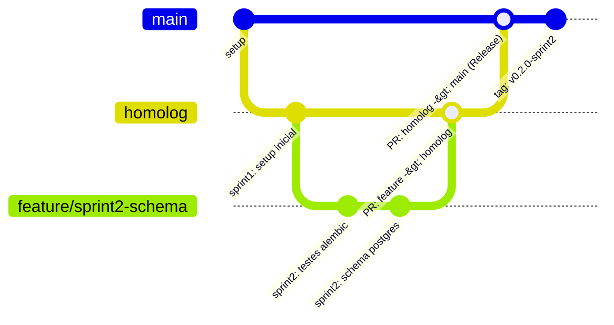

# Governança de Git, Branches e CI/CD — SIGAAS

Este documento estabelece o modelo de versionamento, fluxo de branches, políticas de proteção e automação de CI/CD para o projeto **SIGAAS**.

---

## 1. Modelo de Branches

Adotamos um modelo baseado em **GitFlow Simplificado (Trunk-based adaptado para Sprints acadêmicas)**:

### 1.1 Branches Principais (Permanentes e Protegidas)
- **`main` (Produção / Release Estável):**
  - Contém o código aprovado e estável de cada Sprint.
  - **Nunca recebe commits diretos.** Apenas via Pull Request aprovado vindo de `homolog`.
  - Cada marco de Sprint gera uma Tag de release (`v0.1.0`, `v0.2.0-sprint2`, etc.).
- **`homolog` (Ambiente de Integração Contínua):**
  - Onde as features e correções são integradas e testadas pelo CI antes de ir para a `main`.
  - Protegida contra push direto. Atualizada via PR das branches de features.

### 1.2 Branches Temporárias (Efêmeras / Auto-delete)
- **`feature/<sprint>-<nome>`** (ex: `feature/sprint2-schema-postgres`):
  - Criadas a partir de `homolog` para desenvolver uma Spec.
- **`fix/<nome>`** (ex: `fix/cors-origins`):
  - Para correções de bugs identificados nos testes.
- **`chore/<nome>`** (ex: `chore/atualizar-dependencias`):
  - Para melhorias de tooling, documentação ou scripts.
- **Auto-delete:** Assim que o PR for aprovado e mesclado, a branch efêmera é automaticamente excluída pelo GitHub.

---

## 2. Políticas de Proteção de Branch (Branch Policies)

Para as branches `main` e `homolog`:
1. **Require a pull request before merging:**
   - Bloqueia `git push` direto para `main` e `homolog`.
   - Exige abertura formal de PR.
2. **Require approvals (Mínimo 1 revisão):**
   - Garante que nenhuma mudança entre sem revisão humana ou do responsável técnico.
3. **Require status checks to pass before merging:**
   - O PR só pode ser mesclado se o GitHub Actions CI estiver 100% verde:
     - `Backend (FastAPI, Ruff, Bandit & Pytest)`
     - `Motor de Alocacao (C + OpenMP)`
     - `Validacao de Scripts e Ferramentas`
4. **Dismiss stale pull request approvals when new commits are pushed:**
   - Se novos commits forem adicionados ao PR, qualquer aprovação anterior é invalidada para nova checagem.
5. **Require conversation resolution before merging:**
   - Todos os comentários e revisões devem ser marcados como resolvidos.
6. **Block force pushes & branch deletions:**
   - Protege o histórico contra `git push --force` e exclusões acidentais.

---

## 3. Automação de CI/CD (GitHub Actions)

### 3.1 Pipeline de CI (`.github/workflows/ci.yml`)
- Disparada em:
  - Qualquer `push` para `main` ou `homolog`.
  - Qualquer `pull_request` aberto contra `main` ou `homolog`.
- Etapas:
  1. Instalação do Python 3.12 e dependências.
  2. Linting estático com `Ruff`.
  3. Varredura de vulnerabilidades com `Bandit`.
  4. Execução da suíte completa de testes com `Pytest`.
  5. Compilação do motor em C com OpenMP (`Makefile`) garantindo que a biblioteca compartilhada `.so` seja gerada com sucesso.

### 3.2 Pipeline de Release (`.github/workflows/release.yml`)
- Disparada ao criar tags no padrão `v*` (ex: `v0.2.0-sprint2`).
- Gera automaticamente uma GitHub Release com changelog das alterações e links de download.

---

## 4. Convenção de Commits e Releases

- Commits: `sprintN: descrição curta`
  - Exemplos:
    - `sprint2: migration inicial alembic com schema de salas`
    - `sprint3: prototipo navegavel angular com telas de login`
    - `sprint5: paralelismo openmp no motor de alocacao em c`
- Tags de Release:
  - `git tag -a v0.1.0 -m "Release Sprint 1: Setup e Infraestrutura Inicial"`
  - `git push origin v0.1.0`
