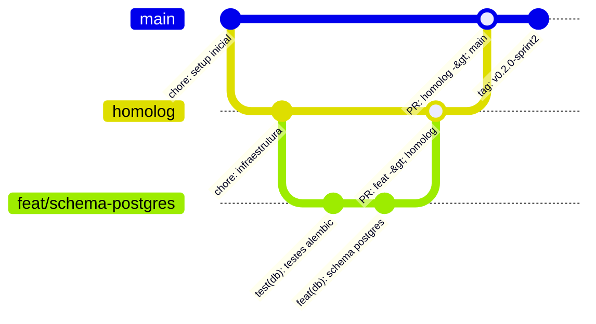

# Governança de Git, Branches e CI/CD — SIGAAS

Este documento estabelece o modelo de versionamento, fluxo de branches, políticas de proteção e automação de CI/CD para o projeto **SIGAAS**.

---

## 1. Modelo de Branches

Adotamos um modelo baseado em **GitFlow Simplificado (Trunk-based adaptado para Sprints acadêmicas)**:

### 1.1 Branches Principais (Permanentes e Protegidas)
- **`main` (Produção / Release Estável):**
  - Contém o código aprovado e estável de cada Sprint.
  - **Nunca recebe commits diretos.** Apenas via Pull Request aprovado vindo de `homolog`.
  - Cada marco de Sprint gera uma Tag de release (`v0.1.0`, `v0.2.0-sprint2`, etc.).
- **`homolog` (Ambiente de Integração Contínua):**
  - Onde as features e correções são integradas e testadas pelo CI antes de ir para a `main`.
  - Protegida contra push direto. Atualizada via PR das branches de features.

### 1.2 Branches Temporárias (Efêmeras / Auto-delete)
- **`feat/<nome>`** (ex: `feat/schema-postgres`, `feat/login-coordenador`):
  - Para implementação de novas funcionalidades derivadas de Specs SDD.
- **`fix/<nome>`** (ex: `fix/cors-origins`, `fix/alocacao-capacidade`):
  - Para correções de bugs identificados nos testes ou em homologação.
- **`docs/<nome>`** (ex: `docs/spec-sprint2`, `docs/atualizar-arquitetura`):
  - Para criação ou alteração de especificações, diagramas e documentação.
- **`chore/<nome>`** (ex: `chore/atualizar-dependencias`, `chore/config-ci`):
  - Para melhorias de tooling, scripts, CI/CD ou dependências.
- **`perf/<nome>`** (ex: `perf/paralelismo-openmp`):
  - Para otimizações de performance e paralelismo no motor em C.
- **`test/<nome>`** (ex: `test/cobertura-alocacao`):
  - Para adição ou ajuste exclusivo de testes automatizados.
- **Auto-delete:** Assim que o PR for aprovado e mesclado, a branch efêmera é automaticamente excluída pelo GitHub.

---

## 2. Políticas de Proteção de Branch (Branch Policies)

Para as branches `main` e `homolog`:
1. **Require a pull request before merging:**
   - Bloqueia `git push` direto para `main` e `homolog`.
   - Exige abertura formal de PR.
2. **Require approvals (Mínimo 1 revisão):**
   - Garante que nenhuma mudança entre sem revisão humana ou do responsável técnico.
3. **Require status checks to pass before merging:**
   - O PR só pode ser mesclado se o GitHub Actions CI estiver 100% verde:
     - `Backend (FastAPI, Ruff, Bandit & Pytest)`
     - `Motor de Alocacao (C + OpenMP)`
     - `Validacao de Scripts e Ferramentas`
4. **Dismiss stale pull request approvals when new commits are pushed:**
   - Se novos commits forem adicionados ao PR, qualquer aprovação anterior é invalidada para nova checagem.
5. **Require conversation resolution before merging:**
   - Todos os comentários e revisões devem ser marcados como resolvidos.
6. **Block force pushes & branch deletions:**
   - Protege o histórico contra `git push --force` e exclusões acidentais.

---

## 3. Automação de CI/CD (GitHub Actions)

### 3.1 Pipeline de CI (`.github/workflows/ci.yml`)
- Disparada em:
  - Qualquer `push` para `main` ou `homolog`.
  - Qualquer `pull_request` aberto contra `main` ou `homolog`.
- Etapas:
  1. Instalação do Python 3.12 e dependências.
  2. Linting estático com `Ruff`.
  3. Varredura de vulnerabilidades com `Bandit`.
  4. Execução da suíte completa de testes com `Pytest`.
  5. Compilação do motor em C com OpenMP (`Makefile`) garantindo que a biblioteca compartilhada `.so` seja gerada com sucesso.

### 3.2 Pipeline de Release (`.github/workflows/release.yml`)
- Disparada ao criar tags no padrão `v*` (ex: `v0.2.0-sprint2`).
- Gera automaticamente uma GitHub Release com changelog das alterações e links de download.

---

## 4. Convenção de Commits e Releases
 
- **Padrão de Commits (Conventional Commits):**
  - Formato: `<tipo>(<escopo>): <descrição curta no imperativo>`
  - Tipos válidos:
    - `feat`: Nova funcionalidade no sistema.
    - `fix`: Correção de defeito/bug.
    - `docs`: Documentação e especificações SDD.
    - `test`: Adição ou refatoração de testes.
    - `perf`: Otimizações de desempenho (ex.: OpenMP no motor C).
    - `refactor`: Refatoração interna sem alteração de comportamento.
    - `chore`: Tarefas de build, dependências ou governança.
    - `ci`: Alterações no pipeline de CI/CD e automações GitHub.
  - Exemplos:
    - `feat(schema): adicionar tabelas de salas, blocos e horarios`
    - `feat(auth): implementar geracao e validacao de token jwt`
    - `test(engine): adicionar testes de integracao ctypes para motor c`
    - `perf(engine): paralelizar alocacao de horarios com openmp`
    - `fix(auth): tratar erro 401 para credenciais invalidas`
    - `docs(specs): adicionar especificacao sdd da sprint 2`
    - `ci(pr-size): validar limite de 400 linhas de codigo no pr`
- **Rastreamento de Sprints:**
  - O controle por Sprint é mantido exclusivamente no ClickUp, GitHub Milestones e tags de release. Commits e branches permanecem desacoplados e semânticos.
- **Tags de Release (Consolidação na `main` ao final da Sprint):**
  - `git tag -a v0.2.0-sprint2 -m "Release Sprint 2: Schema PostgreSQL e Casos de Uso"`
  - `git push origin v0.2.0-sprint2`
